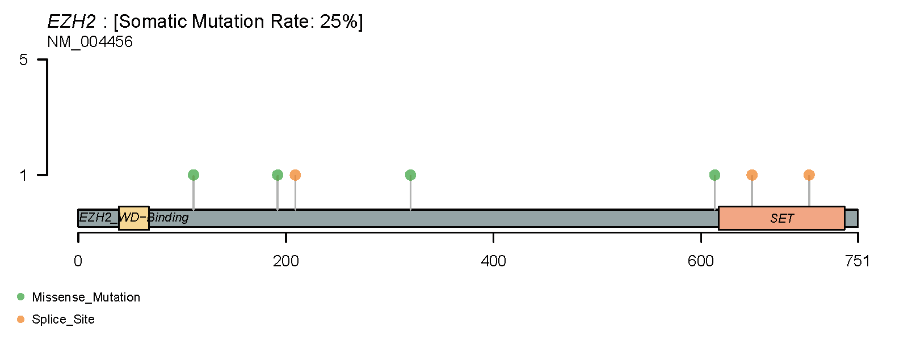

# Data visualization of Figure 1

## Whole exon sequencing data visualization, related to fig 1a,b， and figs.1c.

```R
library(maftools)
library(ggplot2)

files <- c(
  "GSCC_20" = "/mnt/data2/userdata/abao/Published_Project_code/GSCC_code/final_Filter_VCF/GSCC_20.Final.vep.maf",
  "GSCC_19" = "/mnt/data2/userdata/abao/Published_Project_code/GSCC_code/final_Filter_VCF/GSCC_19.Final.vep.maf",
  "GSCC_18" = "/mnt/data2/userdata/abao/Published_Project_code/GSCC_code/final_Filter_VCF/GSCC_18.Final.vep.maf",
  "GSCC_17" = "/mnt/data2/userdata/abao/Published_Project_code/GSCC_code/final_Filter_VCF/GSCC_17.Final.vep.maf",
  "GSCC_16" = "/mnt/data2/userdata/abao/Published_Project_code/GSCC_code/final_Filter_VCF/GSCC_16.Final.vep.maf",
  "GSCC_15" = "/mnt/data2/userdata/abao/Published_Project_code/GSCC_code/final_Filter_VCF/GSCC_15.Final.vep.maf",
  "GSCC_14" = "/mnt/data2/userdata/abao/Published_Project_code/GSCC_code/final_Filter_VCF/GSCC_14.Final.vep.maf",
  "GSCC_13" = "/mnt/data2/userdata/abao/Published_Project_code/GSCC_code/final_Filter_VCF/GSCC_13.Final.vep.maf",
  "GSCC_12" = "/mnt/data2/userdata/abao/Published_Project_code/GSCC_code/final_Filter_VCF/GSCC_12.Final.vep.maf",
  "GSCC_11" = "/mnt/data2/userdata/abao/Published_Project_code/GSCC_code/final_Filter_VCF/GSCC_11.Final.vep.maf",
  "GSCC_10" = "/mnt/data2/userdata/abao/Published_Project_code/GSCC_code/final_Filter_VCF/GSCC_10.Final.vep.maf",
  "GSCC_9" = "/mnt/data2/userdata/abao/Published_Project_code/GSCC_code/final_Filter_VCF/GSCC_9.Final.vep.maf",
  "GSCC_8" = "/mnt/data2/userdata/abao/Published_Project_code/GSCC_code/final_Filter_VCF/GSCC_8.Final.vep.maf",
  "GSCC_7" = "/mnt/data2/userdata/abao/Published_Project_code/GSCC_code/final_Filter_VCF/GSCC_7.Final.vep.maf",
  "GSCC_6" = "/mnt/data2/userdata/abao/Published_Project_code/GSCC_code/final_Filter_VCF/GSCC_6.Final.vep.maf",
  "GSCC_5" = "/mnt/data2/userdata/abao/Published_Project_code/GSCC_code/final_Filter_VCF/GSCC_5.Final.vep.maf",
  "GSCC_4" = "/mnt/data2/userdata/abao/Published_Project_code/GSCC_code/final_Filter_VCF/GSCC_4.Final.vep.maf",
  "GSCC_3" = "/mnt/data2/userdata/abao/Published_Project_code/GSCC_code/final_Filter_VCF/GSCC_3.Final.vep.maf",
  "GSCC_2" = "/mnt/data2/userdata/abao/Published_Project_code/GSCC_code/final_Filter_VCF/GSCC_2.Final.vep.maf",
  "GSCC_1" = "/mnt/data2/userdata/abao/Published_Project_code/GSCC_code/final_Filter_VCF/GSCC_1.Final.vep.maf"
)

all_samples <- list()

for (sample_name in names(files)) {
  maf_data <- read.maf(files[sample_name])
  maf_df <- data.frame(maf_data@data)
  maf_df$sample <- sample_name
  all_samples[[sample_name]] <- maf_df
}
All <- do.call(rbind, all_samples)
All$Frequency <- as.numeric(All$t_alt_count) / as.numeric(All$t_depth)
tmp <- subset(All, Frequency < 1 & t_depth >= 10 & t_alt_count >= 3)
PASS <- subset(tmp, FILTER == "PASS")
write.csv(PASS, file = "1_WES_Final_mutation_calling.csv", row.names = FALSE)

PASS_maf <- read.maf(PASS)
pdf("EZH2_lollipopplot.pdf",width=8,height=3)
lollipopPlot( maf = PASS_maf,gene = 'EZH2',showMutationRate = TRUE)
dev.off()

```



```R

&&&&&&&&&&&&&&&&&&&&&&Fig_1a&&&&&Integration_of_CNV_and_SNV&&&&&&&&&&&&&&&&&&&&&&&&&&&&&&&&&&&&&&&&&&&&
&&&&&&&&&&&&&&&&&&&&&&Fig_1a&&&&&Integration_of_CNV_and_SNV&&&&&&&&&&&&&&&&&&&&&&&&&&&&&&&&&&&&&&&&&&&&
&&&&&&&&&&&&&&&&&&&&&&Fig_1a&&&&&&Integration_of_CNV_and_SNV&&&&&&&&&&&&&&&&&&&&&&&&&&&&&&&&&&&&&&&&&&&&
&&&&&&&&&&&&&&&&&&&&&&Fig_1a&&&&&Integration_of_CNV_and_SNV&&&&&&&&&&&&&&&&&&&&&&&&&&&&&&&&&&&&&&&&&&&&

cns_dir <- "/mnt/data/user_data/xiangyu/workshop/Zhong_ABao/1_Rebuttal_GSCC_for_NatureCommunications/WES_GSCC/All_GSCC_add_PBMC_as_contrl_CNVkit_500bp"
cns_files <- list.files(cns_dir, pattern = "*.call.cns$", full.names = TRUE)
combined_cns <- data.frame()

for (file in cns_files) {
  cns <- read.table(file, sep = "\t", header = TRUE)
  sample_name <- tools::file_path_sans_ext(basename(file))
  cns$sample <- sample_name
  combined_cns <- rbind(combined_cns, cns)
}

cnv_data <- subset(combined_cns, cn == "1" | cn == "0" | cn > 2 )
cnv_data_long <- cnv_data %>%
  separate_rows(gene, sep = ",") %>%
  select(gene, sample, cn)  # 添加 cn 列
cnv_data <- data.frame(cnv_data_long)

library(dplyr)
library(readr)

cnv_data <- cnv_data %>%
  mutate(Type = case_when(
    cn > 3  ~ "Amp",
    cn == 3 ~ "Gain",
    cn == 0 ~ "Deep_Del",
    cn == 1 ~ "Shallow_Del",
    cn == 2 ~ "Neutral" 
  ))

cnv_data <- cnv_data %>% mutate(sample = gsub("_BQSR.call", "", sample))
cnv_data$CN <- cnv_data$cn
CN_TABLE <- cnv_data[,c("gene","sample","Type")]
colnames(CN_TABLE) <- c("Gene", "Sample_name", "CN")

library(dplyr)
library(readr)


maf_data <- read.csv("/mnt/data/user_data/xiangyu/workshop/Zhong_ABao/1_Rebuttal_GSCC_for_NatureCommunications/WES_GSCC/Final_filter_mutation_calling.csv")
oncoKB_from_MSK_database <- read.csv("/mnt/data/user_data/xiangyu/workshop/Zhong_ABao/1_Rebuttal_GSCC_for_NatureCommunications/WES_GSCC/oncoKB_from_MSK_database.csv")
oncoKB_from_MSK_database <- subset(oncoKB_from_MSK_database, OncoKB.Annotated=="Yes")
GSCC_onco <- subset(maf_data, maf_data$Hugo_Symbol %in% oncoKB_from_MSK_database$Hugo.Symbol)
GSCC_onco <- GSCC_onco[order(-GSCC_onco$Frequency),]
GSCC_maf = read.maf(maf=GSCC_onco,cnTable = CN_TABLE)


maf_data <- read.csv("/mnt/data/user_data/xiangyu/workshop/Zhong_ABao/1_Rebuttal_GSCC_for_NatureCommunications/WES_GSCC/Final_filter_mutation_calling.csv")
oncoKB_from_MSK_database <- read.csv("/mnt/data/user_data/xiangyu/workshop/Zhong_ABao/1_Rebuttal_GSCC_for_NatureCommunications/WES_GSCC/oncoKB_from_MSK_database.csv")
oncoKB_from_MSK_database <- subset(oncoKB_from_MSK_database, OncoKB.Annotated=="Yes")
GSCC_onco <- subset(maf_data, maf_data$Hugo_Symbol %in% oncoKB_from_MSK_database$Hugo.Symbol)
GSCC_onco <- GSCC_onco[order(-GSCC_onco$Frequency),]
GSCC_maf = read.maf(maf=GSCC_onco,cnTable = CN_TABLE)

library(ggplot2)
pdf("GSCC_mut_plot_final.pdf",width=15,height=18)
oncoplot(maf = GSCC_maf, genes=c("KMT2A", "KMT2D", "KMT2C", "KMT2B", "TP53", "CREBBP", "EP300", "EZH2","PIK3CA", "MTOR", "PIK3R1", "TSC1", "TSC2", "PTEN", "AKT1", "AKT2"),clinicalFeatures ="Tumor_Sample_Barcode",keepGeneOrder = FALSE)
dev.off()
```


# Targeted bisulfite sequencing data visualization, related to figs.1d.

```R
P18_Tumor <- read.table("/mnt/data2/userdata/abao/Published_Project_code/GSCC_code/TBS_data/P18_Tumor_trimmed_R1_bismark_bt2_pe.CpG_report.txt",head=FALSE,sep="\t")
P18_Normal <- read.table("/mnt/data2/userdata/abao/Published_Project_code/GSCC_code/TBS_data/P18_Normal_trimmed_R1_bismark_bt2_pe.CpG_report.txt",head=FALSE,sep="\t")

P15_Tumor <- read.table("/mnt/data2/userdata/abao/Published_Project_code/GSCC_code/TBS_data/P15_Tumor_trimmed_R1_bismark_bt2_pe.CpG_report.txt",head=FALSE,sep="\t")
P15_Normal <- read.table("/mnt/data2/userdata/abao/Published_Project_code/GSCC_code/TBS_data/P15_Normal_trimmed_R1_bismark_bt2_pe.CpG_report.txt",head=FALSE,sep="\t")

P14_Tumor <- read.table("/mnt/data2/userdata/abao/Published_Project_code/GSCC_code/TBS_data/P14_Tumor_trimmed_R1_bismark_bt2_pe.CpG_report.txt",head=FALSE,sep="\t")
P14_Normal <- read.table("/mnt/data2/userdata/abao/Published_Project_code/GSCC_code/TBS_data/P14_Normal_trimmed_R1_bismark_bt2_pe.CpG_report.txt",head=FALSE,sep="\t")

P13_Tumor <- read.table("/mnt/data2/userdata/abao/Published_Project_code/GSCC_code/TBS_data/P13_Tumor_trimmed_R1_bismark_bt2_pe.CpG_report.txt",head=FALSE,sep="\t")
P13_Normal <- read.table("/mnt/data2/userdata/abao/Published_Project_code/GSCC_code/TBS_data/P13_Normal_trimmed_R1_bismark_bt2_pe.CpG_report.txt",head=FALSE,sep="\t")

P8_Tumor <- read.table("/mnt/data2/userdata/abao/Published_Project_code/GSCC_code/TBS_data/P8_Tumor_trimmed_R1_bismark_bt2_pe.CpG_report.txt",head=FALSE,sep="\t")
P8_Normal <- read.table("/mnt/data2/userdata/abao/Published_Project_code/GSCC_code/TBS_data/P8_Normal_trimmed_R1_bismark_bt2_pe.CpG_report.txt",head=FALSE,sep="\t")

P5_Tumor <- read.table("/mnt/data2/userdata/abao/Published_Project_code/GSCC_code/TBS_data/P5_Tumor_trimmed_R1_bismark_bt2_pe.CpG_report.txt",head=FALSE,sep="\t")
P5_Normal <- read.table("/mnt/data2/userdata/abao/Published_Project_code/GSCC_code/TBS_data/P5_Normal_trimmed_R1_bismark_bt2_pe.CpG_report.txt",head=FALSE,sep="\t")

P4_Tumor <- read.table("/mnt/data2/userdata/abao/Published_Project_code/GSCC_code/TBS_data/P4_Tumor_trimmed_R1_bismark_bt2_pe.CpG_report.txt",head=FALSE,sep="\t")
P4_Normal <- read.table("/mnt/data2/userdata/abao/Published_Project_code/GSCC_code/TBS_data/P4_Normal_trimmed_R1_bismark_bt2_pe.CpG_report.txt",head=FALSE,sep="\t")


library(ggplot2)
library(dplyr)
library(patchwork)

samples <- c("P4", "P5", "P8", "P13", "P14", "P15", "P18")

# EZH2 启动子附近参考位置
EZH2_start <- 148883700

# 三个坐标范围
peak_ranges <- list(
  c(148883786, 148883935),
  c(148884063, 148884256),
  c(148884749, 148884918)
)

for (sample in samples) {
  tumor_file <- paste0("/mnt/data2/userdata/abao/Published_Project_code/GSCC_code/TBS_data/", sample, "_Tumor_trimmed_R1_bismark_bt2_pe.CpG_report.txt")
  normal_file <- paste0("/mnt/data2/userdata/abao/Published_Project_code/GSCC_code/TBS_data/", sample, "_Normal_trimmed_R1_bismark_bt2_pe.CpG_report.txt")
  
  Tumor <- read.table(tumor_file, head = FALSE, sep = "\t")
  Normal <- read.table(normal_file, head = FALSE, sep = "\t")
  
  Tumor_EZH2 <- subset(Tumor, V1 == "chr:7")
  Normal_EZH2 <- subset(Normal, V1 == "chr:7")
  
  Tumor_freq <- data.frame(position = EZH2_start + Tumor_EZH2$V2,
                           CpG_methy_ratio = Tumor_EZH2$V4 / (Tumor_EZH2$V4 + Tumor_EZH2$V5))
  Normal_freq <- data.frame(position = EZH2_start + Normal_EZH2$V2,
                            CpG_methy_ratio = Normal_EZH2$V4 / (Normal_EZH2$V4 + Normal_EZH2$V5))
  
  Tumor_freq[is.na(Tumor_freq)] <- 0
  Normal_freq[is.na(Normal_freq)] <- 0
  
  Tumor_freq <- Tumor_freq[order(Tumor_freq$position), ]
  Normal_freq <- Normal_freq[order(Normal_freq$position), ]
  
  data <- data.frame(position = Normal_freq$position,
                     N_ratio = Normal_freq$CpG_methy_ratio,
                     T_ratio = Tumor_freq$CpG_methy_ratio,
                     T_vs_N = Tumor_freq$CpG_methy_ratio - Normal_freq$CpG_methy_ratio)
  
  data <- data %>%
    mutate(
      Normal_me_state = ifelse(N_ratio == 0 & T_ratio == 0, 0, ifelse(T_vs_N < 0, 1, 0)),
      Tumor_me_state = ifelse(N_ratio == 0 & T_ratio == 0, 0, ifelse(T_vs_N > 0, 1, 0))
    )
  peak_plots <- list()
  
  for (i in 1:3) {
    range <- peak_ranges[[i]]
    peak <- subset(data, position >= range[1] & position <= range[2])
    
    peak <- peak %>%
      mutate(row_group = (row_number() - 1) %/% 8,
             col_pos = (row_number() - 1) %% 8,
             Normal_me_state = ifelse(N_ratio < 0.025, "0", "1"),
             Tumor_me_state = ifelse(T_ratio < 0.025, "0", "1"))
    
    Normal_plot <- ggplot(peak, aes(x = col_pos * 0.7, y = -row_group * 0.8)) +
      geom_point(aes(fill = factor(Normal_me_state)), shape = 21, size = 3, color = "black") +
      scale_fill_manual(values = c("0" = "white", "1" = "black")) +
      theme_minimal() +
      labs(x = "Position in Group", y = "Read", fill = "Methylation Status") +
      theme(axis.text.y = element_blank(), axis.ticks.y = element_blank(), panel.grid = element_blank()) +
      coord_fixed(ratio = 1.0)
    
    Tumor_plot <- ggplot(peak, aes(x = col_pos * 0.7, y = -row_group * 0.8)) +
      geom_point(aes(fill = factor(Tumor_me_state)), shape = 21, size = 3, color = "black") +
      scale_fill_manual(values = c("0" = "white", "1" = "black")) +
      theme_minimal() +
      labs(x = "Position in Group", y = "Read", fill = "Methylation Status") +
      theme(axis.text.y = element_blank(), axis.ticks.y = element_blank(), panel.grid = element_blank()) +
      coord_fixed(ratio = 1.0)
    
    peak_plots[[i]] <- Normal_plot + Tumor_plot
  }
  
  final_plot <- peak_plots[[1]] / peak_plots[[2]] / peak_plots[[3]]
  ggsave(filename = paste0(sample, "_Normal_and_Tumor.png"), plot = final_plot, width = 6, height = 9)
}

```


```R


library(ggplot2)
library(data.table)
library(patchwork)

samples <- c("P4", "P5", "P8", "P13", "P14", "P15", "P18")
region_start <- 148883700
region_end <- 148885800

for (sample in samples) {
  
  Normal <- get(paste0(sample, "_Normal"))
  Tumor <- get(paste0(sample, "_Tumor"))

  Normal_EZH2 <- subset(Normal, V1 == "chr:7")
  Tumor_EZH2 <- subset(Tumor, V1 == "chr:7")
  
  Normal_freq <- data.frame(
    position = region_start + Normal_EZH2$V2,
    CpG_methy_ratio = Normal_EZH2$V4 / (Normal_EZH2$V4 + Normal_EZH2$V5)
  )
  Tumor_freq <- data.frame(
    position = region_start + Tumor_EZH2$V2,
    CpG_methy_ratio = Tumor_EZH2$V4 / (Tumor_EZH2$V4 + Tumor_EZH2$V5)
  )
  
  Normal_freq[is.na(Normal_freq)] <- 0
  Tumor_freq[is.na(Tumor_freq)] <- 0
  Normal_freq <- Normal_freq[order(Normal_freq$position),]
  Tumor_freq <- Tumor_freq[order(Tumor_freq$position),]
  
  tmp_data <- data.frame(
    position = Normal_freq$position,
    N_ratio = Normal_freq$CpG_methy_ratio,
    T_ratio = Tumor_freq$CpG_methy_ratio,
    T_vs_N = Tumor_freq$CpG_methy_ratio - Normal_freq$CpG_methy_ratio
  )
  
  tmp_data <- tmp_data[tmp_data$T_vs_N > 0 | tmp_data$T_vs_N < 0, ]
  tmp_data <- tmp_data[order(tmp_data$position),]

  list_all <- data.frame(chr7_pos = region_start:region_end, order = 1:(region_end - region_start + 1))
  tmp_data <- merge(list_all, tmp_data, by.x = "chr7_pos", by.y = "position", all.x = TRUE)
  tmp_data[is.na(tmp_data)] <- 0

  Normal_EZH2 <- data.frame(Methy = tmp_data$N_ratio, Group = "Normal", SampleID = tmp_data$chr7_pos)
  Tumor_EZH2 <- data.frame(Methy = tmp_data$T_ratio, Group = "Tumor", SampleID = tmp_data$chr7_pos)

  Normal_EZH2 <- Normal_EZH2[order(Normal_EZH2$SampleID),]
  Tumor_EZH2 <- Tumor_EZH2[order(Tumor_EZH2$SampleID),]

  plot_theme <- theme(
    axis.text.x = element_text(angle = 90, hjust = 1),
    panel.grid = element_blank(),
    axis.line = element_line(colour = 'black', size = 1),
    panel.background = element_blank(),
    plot.title = element_text(size = 15, hjust = 0.5),
    plot.subtitle = element_text(size = 13, hjust = 0.5, face = "italic"),
    axis.text = element_text(size = 15, color = 'black'),
    axis.title = element_text(size = 15, color = 'black'),
    legend.title = element_blank()
  )


ff_Normal <- ggplot(Normal_EZH2, aes(x = SampleID, y = Methy, fill = Group)) +
  geom_bar(stat = "identity", position = "dodge", color = "black", size = 0.6) +
  scale_fill_manual(values = c('Normal' = '#00AFBB', 'Tumor' = '#E7B800')) +
  plot_theme +
  labs(
    x = 'SampleID', y = 'Methy',
    title = paste(sample, "Normal"),
    subtitle = "#EZH2: Chromosome 7: 148,883,700-148,885,800"
  ) +
  scale_y_continuous(limits = c(0, 0.4))

ff_Tumor <- ggplot(Tumor_EZH2, aes(x = SampleID, y = Methy, fill = Group)) +
  geom_bar(stat = "identity", position = "dodge", color = "black", size = 0.6) +
  scale_fill_manual(values = c('Normal' = '#00AFBB', 'Tumor' = '#E7B800')) +
  plot_theme +
  labs(
    x = 'SampleID', y = 'Methy',
    title = paste(sample, "Tumor"),
    subtitle = "#EZH2: Chromosome 7: 148,883,700-148,885,800"
  ) +
  scale_y_continuous(limits = c(0, 0.4))
  

  combined_plot <- ff_Normal / ff_Tumor

  ggsave(combined_plot, filename = paste0(sample, "_EZH2_barplot.png"), width = 6, height = 8)
}
```


# TCGA-STAD analysis visualization, related to Fig.1d-1g.

```R
suppressPackageStartupMessages({
   library(Rsamtools)
   library(GenomicFeatures)
   library(GenomicAlignments)
   library(BiocParallel)
   library(pheatmap)
   library(RColorBrewer)
   library(PoiClaClu)
   library(org.Mm.eg.db)
   library(AnnotationDbi)
   library(DOSE)
   library(clusterProfiler)
   library(topGO)
   library(pathview)
   library(org.Hs.eg.db)
   library(AnnotationDbi)
   library(DOSE)
   library(clusterProfiler)
   library(topGO)
   library(ggplot2)
})

STAD_FPKM_tumor <- read.csv("/mnt/data2/userdata/abao/Published_Project_code/GSCC_code/TCGA_data/STAD_FPKM_tumor.csv")
ESCA_squa_sig  <- read.csv("/mnt/data2/userdata/abao/Published_Project_code/GSCC_code/TCGA_data/1_TCGA_ESCA_suqa_vs_other_res_pj_mouse.csv")
ESCA_sig <- subset(ESCA_squa_sig,padj < 0.05 & log2FoldChange > 1)
ESCA_sig <- ESCA_sig[order(-ESCA_sig$log2FoldChange),]

squamous_sig <- data.frame(ESCA_sig$SYMBOL)
names(squamous_sig) <- "SYMBOL"
squamous_Exp <- merge(STAD_FPKM_tumor,squamous_sig,by="SYMBOL")
squamous_Exp <- squamous_Exp[!duplicated(squamous_Exp$SYMBOL),]
rownames(squamous_Exp) <- squamous_Exp$SYMBOL
squamous_Exp <- squamous_Exp[,c(-1,-2,-3)]
squamous_Exp_1 <- data.frame(apply(squamous_Exp,2,mean)) 
squamous_Exp <- data.frame(squamous_Exp_1)
names(squamous_Exp) <- "squamous_exp"

EZH2_Exp <- subset(STAD_FPKM_tumor,SYMBOL=="EZH2")
rownames(EZH2_Exp) <- EZH2_Exp$SYMBOL
EZH2_Exp_1 <- EZH2_Exp[,c(-1,-2)]
EZH2_Exp <- data.frame(t(EZH2_Exp_1[,c(-376)]))

tmp <- cbind(squamous_Exp,EZH2_Exp)
tmp_log2 <- log(tmp+1,2)


STAD_clinical <- read.csv("/mnt/data2/userdata/abao/Published_Project_code/GSCC_code/TCGA_data/TCGA-STAD_clinical.csv")
tmp_log2$Tumor_Sample_Barcode <- rownames(tmp_log2) 
tmp_log2$Tumor_Sample_Barcode <- substring(tmp_log2$Tumor_Sample_Barcode,1,12)
tmp_log2_1 <- merge(tmp_log2,STAD_clinical,by="Tumor_Sample_Barcode")
meta <- tmp_log2_1
meta[is.na(meta$days_to_last_follow_up),]$days_to_last_follow_up <- "HHH"
tmp <- subset(meta,days_to_last_follow_up=="HHH")
tmp$days_to_last_follow_up <- tmp$days_to_death
no_na <- meta[setdiff(rownames(meta),rownames(tmp)),]
all_merge <- rbind(tmp,no_na)
all_merge <- subset(all_merge,days_to_last_follow_up != "HHH")

#all_merge <- meta
all_merge$vital_status <- as.character(all_merge$vital_status)
all_merge$status <- ifelse(all_merge$vital_status=="Alive",0,1)
all_merge$days_to_last_follow_up <- as.numeric(all_merge$days_to_last_follow_up)
all_merge <- all_merge[order(-all_merge$squamous_exp),]

library("survival")
library("survminer")
all_merge.cut <- surv_cutpoint(
   all_merge,
   time = "days_to_last_follow_up",
   event = "status",
   variables = c("squamous_exp"),
   progressbar=TRUE,
   minprop=0.05)
summary(all_merge.cut)
all_merge.cut.cat <- surv_categorize(all_merge.cut) 
library(survival)
fit <- survfit(Surv(days_to_last_follow_up, status) ~ squamous_exp, data = all_merge.cut.cat)
pdf("Fig_1f_Survival_curve_final.pdf")
ggsurvplot(fit, data = all_merge.cut.cat,
surv.median.line = "hv",
pval = TRUE,
ggtheme = theme_bw(),
risk.table=TRUE)
dev.off()
```


```R
ff2 <- ggplot(all_merge, aes(y=EZH2, x= squamous_exp))+geom_point() + stat_smooth(method=lm)+stat_cor(data=all_merge, method = "pearson")
ggsave(ff2,file="0426_EZH2_squamous_correlation_final.png",width=6,height=6.4)
```


```R
Patient_Group <- tmp_1[,c("Tumor_Sample_Barcode","Group")]
STAD_FPKM_tumor <- read.csv("/mnt/data2/userdata/abao/Published_Project_code/GSCC_code/TCGA_data/STAD_FPKM_tumor.csv")
rownames(STAD_FPKM_tumor) <- STAD_FPKM_tumor$ENSG
STAD_FPKM_tumor <- STAD_FPKM_tumor[,c(-1,-2)]
STAD_FPKM_tumor <- STAD_FPKM_tumor[,c(-376)]
STAD_FPKM <- data.frame(t(STAD_FPKM_tumor))

STAD_FPKM$Tumor_Sample_Barcode <- substring(rownames(STAD_FPKM),1,12)

STAD_FPKM_1 <- merge(STAD_FPKM,Patient_Group,by="Tumor_Sample_Barcode")

Squamous_high <- subset(STAD_FPKM_1,Group=="Squamous_hi")
rownames(Squamous_high) <- Squamous_high$Tumor_Sample_Barcode
Squamous_high <- Squamous_high[,c(-1,-56514)]
Squamous_high_1 <- data.frame(t(Squamous_high))

Squamous_low <- subset(STAD_FPKM_1,Group=="Squamous_low")
rownames(Squamous_low) <- Squamous_low$Tumor_Sample_Barcode
Squamous_low <- Squamous_low[,c(-1,-56514)]
Squamous_low_1 <- data.frame(t(Squamous_low))


# calculate Squa hi vs low DEGs and logFoldChanges

logFC <- log2(rowMeans(as.matrix(Squamous_high_1)+1) / rowMeans(as.matrix(Squamous_low_1)+1))

library("future.apply")
p_values <- future_lapply(seq(1,nrow(Squamous_high_1)), function(x){
  res <- wilcox.test(x = t(Squamous_high_1[x,])[,1], y = t(Squamous_low_1[x,])[,1] )
  res$p.value
})
p <- unlist(p_values)
p.adj <- p.adjust(p, method = "fdr")
genelist <- as.data.frame(logFC)
genelist$p_values <- p
genelist$p_adj <- p.adj
genelist$gene <- rownames(genelist)

aa <- cbind(Squamous_high_1,Squamous_low_1)
basemean <- apply(aa,1,mean)
all <- cbind(basemean,genelist)

all$SYMBOL <- mapIds(x = org.Hs.eg.db,
                        keys = rownames(all),
                  keytype ="ENSEMBL",
                  column ="SYMBOL",
                  multiVals="first")
write.csv(all,"TCGA_STAD_Squamous_58hi_vs_313low_Wilcox_test.csv")


********************************************************************************************
********************************volcano_plot************************************************
********************************************************************************************
********************************************************************************************

library(future)
library(future.apply)
options(future.globals.maxSize = 3000 * 1024^2)
plan("multiprocess", workers = 8)
plan()
library("ggplot2")
library("ggrepel")

STAD_tpm <- read.csv("/mnt/data2/userdata/abao/Published_Project_code/GSCC_code/TCGA_data/TCGA_STAD_Squamous_58hi_vs_313low_Wilcox_test.csv")
genes_plant <- c("MUC17","MUC13","LGR5","TFF1","ASCL2","MUC3A","MUC1","MKI67","ERBB2","EZH2","KRT5","KRT6A","KRT6C","KRT14","KRT6B","KRT24")
STAD_tpm <- na.omit(STAD_tpm)
library(ggplot2)

logFC <-STAD_tpm$logFC
pvalue <- STAD_tpm$p_values
data <- data.frame(logFC=logFC,pvalue=pvalue)
data$sig[(data$pvalue > 0.05|data$pvalue=="NA" | -1 < data$pvalue |  data$pvalue < -1 )] <- "no"

data$sig[data$pvalue <= 0.05 & data$logFC >= 0.5] <- "up"
data$sig[data$pvalue <= 0.05& data$logFC <= -0.5] <- "down"
data$symbol <- STAD_tpm$SYMBOL
data$log10_pvalue <- -log10(data$pvalue)

range(data$log10_pvalue)
data$log10_pvalue[data$log10_pvalue > 22] <- 22

data$logFC[data$logFC > 5] <- 5
data$logFC[data$logFC < -5] <- -5

sel_genes <- function(gene){
  tmp <- subset(data,symbol==gene)
  return(tmp)
}
aa <- future_lapply(as.list(as.character(genes_plant)),sel_genes)
all_res_plant <- do.call(rbind,aa)

ff <- ggplot(data, aes(x = logFC, y = log10_pvalue, color = sig)) +
geom_point(alpha = 0.6, size = 1) +

scale_colour_manual(values  = c('#FF3333','#0066CC','grey'), limits = c('up', 'down', 'no')) +
theme(panel.grid = element_blank(), panel.background = element_rect(color = 'black', fill = 'transparent'), plot.title = element_text(hjust = 0.5)) +
theme(legend.key = element_rect(fill = 'transparent'), legend.background = element_rect(fill = 'transparent'), legend.position = c(0.9, 0.93)) +
geom_vline(xintercept = c(-0.5, 0.5), color = 'gray', size = 0.3) +
geom_hline(yintercept = -log(0.05, 10), color = 'gray', size = 0.3) +
xlim(-5, 5) + ylim(0, 22) +
labs(x = '\nLog2 Fold Change', y = '-log10(pvalue)\n', color = '', title = '\n')+ theme(legend.position = 'right') +
geom_text_repel(data = all_res_plant, aes(x = logFC, y = -log10(pvalue), label = symbol),
        size = 5,fontface="bold", 
    color="grey50", box.padding=unit(0.35, "lines"), 
    point.padding=unit(0.5, "lines"), segment.colour = "grey50")
ggsave(ff,file="FigS1e_volcono.png",width=6,height=5.7)


```


```R
library(ggpubr)
library(ggplot2)
rownames(tmp_2) <- tmp_2$Tumor_Sample_Barcode
my_comparisons <- list(c("squamous_hi", "squamous_low"))
tmp_3 <- tmp_2[,c("Group_squamous","EZH2")]
ff1 <- ggboxplot(tmp_3, x ="Group_squamous", y = "EZH2",add = "jitter",
               color ="Group_squamous",palette = c("#08519c","#e31a1c")) +
stat_compare_means(comparisons = my_comparisons, label = "p.format",method="wilcox.test")

ggsave(ff1,file="Fig_1d_EZH2_squamous_group.png",width=5,height=6.4)
```


```shell

java -cp /mnt/data/userdata/xiangyu/programme/gsea-3.0.jar -Xmx10240m xtools.gsea.Gsea \
-res /mnt/data/userdata/abao/project/1_bulk_sequence/13_ZhangMengsha/Clinical_data/Squamous_Clinical/Squamous_58hi_vs_313low.gct \
-cls /mnt/data/userdata/abao/project/1_bulk_sequence/13_ZhangMengsha/Clinical_data/Squamous_Clinical/Squamous_58hi_vs_313low.cls#Squamous_hi_versus_Squamous_low \
-gmx /mnt/data/userdata/xiangyu/programme/gsea/msigdb_v6.1_files_to_download_locally/msigdb_v6.1_GMTs/c5.all.v6.1.symbols.gmt \
-chip /mnt/data/userdata/xiangyu/programme/gsea/chip/ENSEMBL_human_gene.chip \
-collapse true -mode Max_probe -norm meandiv -nperm 1000 -permute gene_set \
-rnd_type no_balance -scoring_scheme weighted -rpt_label my_analysis \
-metric Signal2Noise -sort real -order descending -include_only_symbols true \
-make_sets true -median false -num 100 -plot_top_x 200 -rnd_seed timestamp \
-save_rnd_lists false -set_max 500 -set_min 15 -zip_report false \
-out /mnt/data/userdata/abao/project/1_bulk_sequence/13_ZhangMengsha/Clinical_data/Squamous_Clinical/Squamous_58hi_vs_313low_c5 -gui false


java -cp /mnt/data/userdata/xiangyu/programme/gsea-3.0.jar -Xmx10240m xtools.gsea.Gsea \
-res /mnt/data/userdata/abao/project/1_bulk_sequence/13_ZhangMengsha/Clinical_data/Squamous_Clinical/Squamous_58hi_vs_313low.gct \
-cls /mnt/data/userdata/abao/project/1_bulk_sequence/13_ZhangMengsha/Clinical_data/Squamous_Clinical/Squamous_58hi_vs_313low.cls#Squamous_hi_versus_Squamous_low \
-gmx /mnt/data/userdata/xiangyu/programme/gsea/msigdb_v6.1_files_to_download_locally/msigdb_v6.1_GMTs/c2.all.v6.1.symbols.gmt \
-chip /mnt/data/userdata/xiangyu/programme/gsea/chip/ENSEMBL_human_gene.chip \
-collapse true -mode Max_probe -norm meandiv -nperm 1000 -permute gene_set \
-rnd_type no_balance -scoring_scheme weighted -rpt_label my_analysis \
-metric Signal2Noise -sort real -order descending -include_only_symbols true \
-make_sets true -median false -num 100 -plot_top_x 200 -rnd_seed timestamp \
-save_rnd_lists false -set_max 500 -set_min 15 -zip_report false \
-out /mnt/data/userdata/abao/project/1_bulk_sequence/13_ZhangMengsha/Clinical_data/Squamous_Clinical/Squamous_58hi_vs_313low_c2 -gui false

java -cp /mnt/data/userdata/xiangyu/programme/gsea-3.0.jar -Xmx10240m xtools.gsea.Gsea \
-res /mnt/data/userdata/abao/project/1_bulk_sequence/13_ZhangMengsha/Clinical_data/Squamous_Clinical/Squamous_58hi_vs_313low.gct \
-cls /mnt/data/userdata/abao/project/1_bulk_sequence/13_ZhangMengsha/Clinical_data/Squamous_Clinical/Squamous_58hi_vs_313low.cls#Squamous_hi_versus_Squamous_low \
-gmx /mnt/data/userdata/xiangyu/programme/gsea/msigdb_v6.1_files_to_download_locally/msigdb_v6.1_GMTs/h.all.v6.1.symbols.gmt \
-chip /mnt/data/userdata/xiangyu/programme/gsea/chip/ENSEMBL_human_gene.chip \
-collapse true -mode Max_probe -norm meandiv -nperm 1000 -permute gene_set \
-rnd_type no_balance -scoring_scheme weighted -rpt_label my_analysis \
-metric Signal2Noise -sort real -order descending -include_only_symbols true \
-make_sets true -median false -num 100 -plot_top_x 200 -rnd_seed timestamp \
-save_rnd_lists false -set_max 500 -set_min 15 -zip_report false \
-out /mnt/data/userdata/abao/project/1_bulk_sequence/13_ZhangMengsha/Clinical_data/Squamous_Clinical/Squamous_58hi_vs_313low_h -gui false
```

