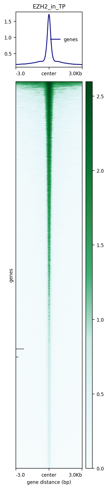
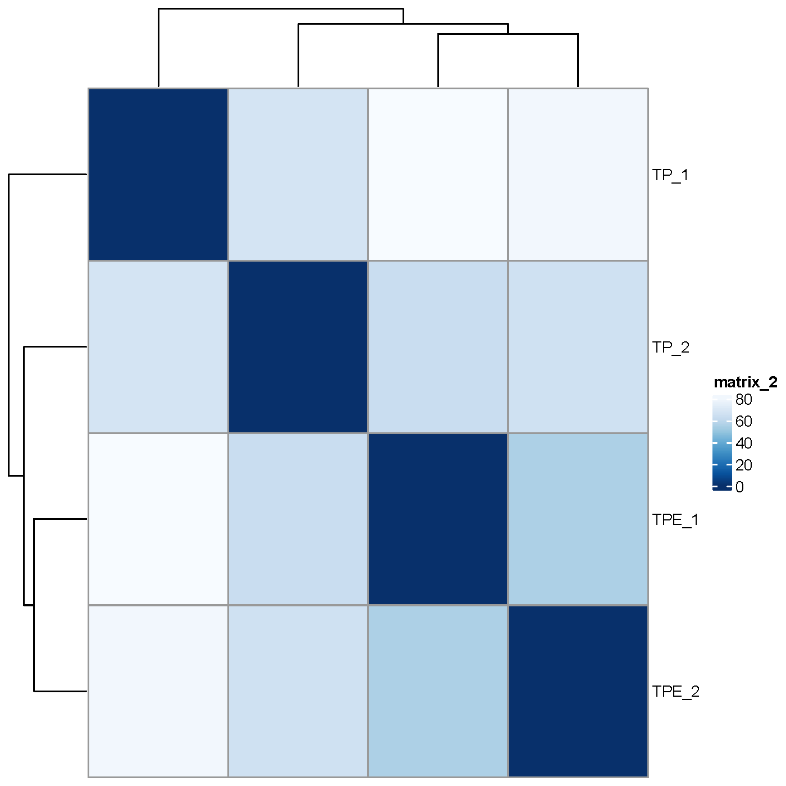
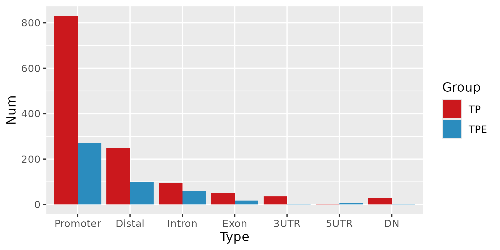

# Data visualization of Figure 4


```R
library(Seurat)
library(ggplot2)
library(pheatmap)
require(RColorBrewer)

adjusted_heatmap <- function (seurat_obj=seurat_obj, group=group,genes=genes,all_num=all_num,assay_sel=assay_sel,labels_rot=labels_rot,
  color=color,min_and_max_cut=num_cut,new_names=new_names,show_row_names=show_row_names,mark_gene=mark_gene,label_size=label_size,scale=scale){
  message("Processed data begain")
  ATAC <- GetAssayData(seurat_obj,layers ="data",assay=assay_sel)
  ATAC_sel <- ATAC[genes,]
  ATAC_sel <- as.matrix(ATAC_sel)
  if (scale==TRUE) {
    ATAC_sel_zscore <- t(apply(ATAC_sel, 1, function(x) (x-mean(x))/sd(x)))
    } else {
      ATAC_sel_zscore <- ATAC_sel
    }
  sel_cutoff <- min(abs(range(ATAC_sel_zscore)))
  if (is.null(min_and_max_cut)){
    ATAC_sel_zscore[ATAC_sel_zscore > sel_cutoff] <- sel_cutoff
    ATAC_sel_zscore[ATAC_sel_zscore < -sel_cutoff] <- -sel_cutoff
    } else {
      ATAC_sel_zscore[ATAC_sel_zscore > min_and_max_cut] <- min_and_max_cut
      ATAC_sel_zscore[ATAC_sel_zscore < -min_and_max_cut] <- -min_and_max_cut
    }
  meta_info <- seurat_obj@meta.data
  meta_info <- meta_info[order(meta_info[,group],decreasing=F),]
  annotation = data.frame(new_anno=meta_info[group],cell_id=rownames(meta_info))
  colnames(annotation) <- c("new_anno","cell_id")
  if (all_num == TRUE & !is.null(new_names)){
    annotation$new_anno <- paste(new_names,annotation$new_anno,sep="")
    aa <- as.data.frame(table(annotation$new_anno))
    aa <- aa[order(aa$Freq,decreasing=T),]
    aa$Var1 <- as.character(aa$Var1)
    annotation$new_anno <- factor(annotation$new_anno,levels=aa$Var1)
  }
  annotation <- annotation[order(annotation$new_anno),]
  annotation = data.frame(new_anno=annotation$new_anno,row.names=rownames(annotation))
  require(pheatmap)
  message("pheatmap printing start")
  require(ComplexHeatmap)
  require(BuenColors)
  require(scales) 
  col1 <- jdb_palette("Darjeeling2")
  col2 <- jdb_palette("Darjeeling")
  col3 <- jdb_palette("Moonrise3")
  col_sel <- c(col1,col2,col3)
  col_sel <- hue_pal()(length(as.character(unique(annotation$new_anno))))
  col <- col_sel[1:length(as.character(unique(annotation$new_anno)))]
  names(col) <- as.character(unique(annotation$new_anno))
  top_anno <- HeatmapAnnotation(
  cluster = anno_block(gp = gpar(fill = col), # 设置填充色
  labels = as.character(unique(annotation$new_anno)), 
  labels_gp = gpar(cex = label_size , col = "black"),labels_rot=labels_rot))
  if (is.null(mark_gene)){
  ph <- Heatmap(ATAC_sel_zscore[,rownames(annotation)],
    cluster_rows = FALSE,
    cluster_columns = FALSE,
    show_column_names = FALSE,
    show_row_names = show_row_names,
    top_annotation = top_anno,
    col = rev(color),
    column_split = annotation$new_anno,
    column_title_rot = 90, use_raster = TRUE)
    } else {
      both_gene <- intersect(rownames(ATAC_sel_zscore[,rownames(annotation)]),mark_gene)
      gene_pos <- which(rownames(ATAC_sel_zscore[,rownames(annotation)]) %in% both_gene)
      selected_gene <- rownames(ATAC_sel_zscore[,rownames(annotation)])[gene_pos]
      row_anno <-  rowAnnotation(mark_gene = anno_mark(at = gene_pos, labels = selected_gene))
      ph <- Heatmap(ATAC_sel_zscore[,rownames(annotation)],
        cluster_rows = FALSE,
        cluster_columns = FALSE,
        show_column_names = FALSE,
        show_row_names = show_row_names,
        top_annotation = top_anno,
        right_annotation = row_anno,
        col = rev(color),
        column_split = annotation$new_anno,
        column_title_rot = 90, use_raster = TRUE)
    }
    return(ph)
    print(ph)
}

Tumor_RNA <- read.csv("/mnt/data2/userdata/abao/Published_Project_code/GSCC_code/RNAseq_data/Tumor_DEseq2normalized_TPE_VS_TP_allsummry.csv")
Tumor_RNA <- na.omit(Tumor_RNA)

sig_Tumor_RNA <- subset(Tumor_RNA,pvalue <=0.05 & abs(log2FoldChange) > 0.5 )

genes_sel <- c("Hoxa9", "Hoxa10",   "Hoxa11os", "Hoxa11",   "Hoxb9", "Nkx2-3",   "Hoxb6", "Hoxb8", "Hoxb4", "Hoxa3", "Hoxa2", "Ncam1", "Hoxaas2",  "Hoxb13",   "Hoxa13",   "Pax3",  "Hoxa7", "Hoxd8", "Foxl2", "Twist2",   "Hoxb5", "Hoxa5", "Hoxa6", "Hoxc10",   "Hoxa4", "Hoxb5os",  "Tfap2c",   "Krt79", "Krt14", "Tff2",  "Muc5ac",   "Muc1",  "Muc5b", "Gkn1",  "Gkn2")
rownames(sig_Tumor_RNA) <- sig_Tumor_RNA$X
sig_Tumor_RNA <- sig_Tumor_RNA[order(-sig_Tumor_RNA$log2FoldChange),]
sig_Tumor_RNA <- sig_Tumor_RNA[,c("DESeq2_TPE_1","DESeq2_TPE_2","DESeq2_TP_1","DESeq2_TP_2")]
tmp_data <- log(sig_Tumor_RNA+1,2)
chonglai_zscore_1 <- t(apply(tmp_data, 1, function(x) (x-mean(x))/sd(x)))
range(chonglai_zscore_1)
chonglai_zscore_1[chonglai_zscore_1 > 1] <- 1
chonglai_zscore_1[chonglai_zscore_1 < -1] <- -1
SeuratObject <- CreateSeuratObject(counts = chonglai_zscore_1, project = "TM")
gene <- rownames(SeuratObject)
SeuratObject@meta.data$group <- rownames(SeuratObject@meta.data)
pdf("Tumor_heatmap_label.pdf",width=8,height=9)
adjusted_heatmap(seurat_obj=SeuratObject,group="orig.ident",gene = gene,all_num=FALSE,new_names=NULL,labels_rot=90,
  assay_sel="RNA",color=colorRampPalette(brewer.pal(10, "RdBu"))(101),
  min_and_max_cut=2,show_row_names=FALSE,mark_gene=genes_sel,label_size=0,scale = FALSE)
dev.off()

```


```R
STAD_squamous_sig  <- read.csv("/mnt/data2/userdata/abao/Published_Project_code/GSCC_code/TCGA_data/Squamous_58hi_vs_313low_Wilcox_test_to_mouse_genes.csv")
ESCA_sig <- subset(STAD_squamous_sig,p_values < 0.05 & logFC > 1)
ESCA_sig <- ESCA_sig[order(-ESCA_sig$logFC),]
ESCA_top <- ESCA_sig[1:489,]
squamous_sig <- data.frame(ESCA_top$mmu_gene)
names(squamous_sig) <- "SYMBOL"

Tumor_RNAseq  <- read.csv("/mnt/data2/userdata/abao/Published_Project_code/GSCC_code/RNAseq_data/Tumor_DEseq2normalized_TPE_VS_TP_to_human_genes.csv")
squamous_Exp <- merge(Tumor_RNAseq,squamous_sig,by.x="X",by.y="SYMBOL")
squamous_Exp <- squamous_Exp[!duplicated(squamous_Exp$X),]

rownames(squamous_Exp) <- squamous_Exp$X
squamous_Exp <- squamous_Exp[,c("DESeq2_TPE_1","DESeq2_TPE_2","DESeq2_TP_1","DESeq2_TP_2")]
squamous_Exp_1 <- data.frame(apply(squamous_Exp,2,mean)) 
squamous_Exp <- data.frame(squamous_Exp_1)
names(squamous_Exp) <- "squamous_exp"

names(squamous_Exp) <- "exp"
tmp_log2 <- log(squamous_Exp+1,2)
tmp_log2$Group <- c("TPE","TPE","TP","TP")
tmp_log2$Group <- factor(tmp_log2$Group,levels=c("TP","TPE"))
library(ggplot2)
library(ggpubr)
my_comparisons <- list(c("TP", "TPE"))

ff <- ggboxplot(tmp_log2, x = "Group", y = "exp",add = "jitter",
               color = "Group",palette = c("#08519c","#e31a1c")) 
ggsave(ff,file="GSCC_Tumor_Squamous_boxplot.png",width=3,height=6.4)

bino_model <- glm(tmp_log2$Group ~ tmp_log2$exp, family="binomial")
anova(bino_model, test="LRT")$"Pr(>Chi)"[2]

```


```R

library(pheatmap)
library(ggplot2)
library(svglite)
library(VennDiagram)
library(clusterProfiler)
library(ChIPseeker)
library(TxDb.Mmusculus.UCSC.mm10.knownGene)


EZH2_Binding_in_TP <- read.csv("/mnt/data2/userdata/abao/Published_Project_code/GSCC_code/CUTTag_data/1_EZH2_Binding_in_TP_all_anno_peaks.csv")

EZH2_Binding_in_TP_Distal <- subset(EZH2_Binding_in_TP,annotation=="Distal Intergenic")
EZH2_Binding_in_TP_Promoter <- subset(EZH2_Binding_in_TP,annotation=="Promoter (<=1kb)" | annotation=="Promoter (1-2kb)" | annotation=="Promoter (2-3kb)")
EZH2_Binding_in_TP_Intron <- subset(EZH2_Binding_in_TP, grepl("^Intron", EZH2_Binding_in_TP$annotation))
EZH2_Binding_in_TP_Exon <- subset(EZH2_Binding_in_TP, grepl("^Exon", EZH2_Binding_in_TP$annotation))
EZH2_Binding_in_TP_3UTR <- subset(EZH2_Binding_in_TP, grepl("^3", EZH2_Binding_in_TP$annotation))
EZH2_Binding_in_TP_5UTR <- subset(EZH2_Binding_in_TP, grepl("^5", EZH2_Binding_in_TP$annotation))
EZH2_Binding_in_TP_DN <- subset(EZH2_Binding_in_TP, grepl("^Down", EZH2_Binding_in_TP$annotation))

EZH2_Binding_in_TP_Distal$group <- "Distal"
EZH2_Binding_in_TP_Promoter$group <- "Promoter"
EZH2_Binding_in_TP_Intron$group <- "Intron"
EZH2_Binding_in_TP_Exon$group <- "Exon"
EZH2_Binding_in_TP_3UTR$group <- "3UTR"
EZH2_Binding_in_TP_5UTR$group <- "5UTR"
EZH2_Binding_in_TP_DN$group <- "Down"

all_tmp <- rbind(EZH2_Binding_in_TP_Distal,EZH2_Binding_in_TP_Promoter,EZH2_Binding_in_TP_Intron,EZH2_Binding_in_TP_Exon,EZH2_Binding_in_TP_3UTR,EZH2_Binding_in_TP_5UTR,EZH2_Binding_in_TP_DN)
all_tmp_1 <- data.frame(table(all_tmp$group ))

library(ggplot2)
library(dplyr)
all_tmp_1 <- all_tmp_1 %>%
  mutate(Percentage = Freq / sum(Freq) * 100,
         Label = paste0(Var1, " (", round(Percentage, 1), "%)"))

ff <- ggplot(all_tmp_1, aes(x = "", y = Freq, fill = Var1)) +
  geom_col(width = 1, color = "white") +
  coord_polar(theta = "y") +
  geom_text(aes(label = Label),
            position = position_stack(vjust = 0.5),
            size = 4) +
  theme_void() +
  labs(title = "EZH2 Binding Distribution") +
  theme(plot.title = element_text(hjust = 0.5))
ggsave(ff,file="Fig4d_EZH2_binding_piechart.pdf")
```


```R
TPE_VS_TP_H3K27me3 <- read.csv("/mnt/data2/userdata/abao/Published_Project_code/GSCC_code/CUTTag_data/1_TPE_VS_TP_H3K27me3_all_anno_peaks.csv")
TPE_VS_TP_H3K27me3 <- TPE_VS_TP_H3K27me3[,c("seqnames","start","end")]
write.table(TPE_VS_TP_H3K27me3,"TPE_VS_TP_H3K27me3_all.txt",row.names =FALSE, col.names =FALSE,sep="\t",quote =FALSE)

bed=/mnt/data2/userdata/abao/Published_Project_code/GSCC_code/CUTTag_data/TPE_VS_TP_H3K27me3_all.bed
computeMatrix reference-point --referencePoint center -b 3000 -a 3000 \
-R $bed \
-S Merge_TP_H3K27me3.bs1.bw Merge_TPE_H3K27me3.bs1.bw \
--numberOfProcessors 30 --skipZeros -o All_peaks_H3K27me3_levels.mat.gz 

plotHeatmap -m All_peaks_H3K27me3_levels.mat.gz -out All_peaks_H3K27me3_levels.png \
--colorList  "#edf8fb,#b3cde3,#8c96c6,#88419d" "#edf8fb,#b3cde3,#8c96c6,#88419d" \
--samplesLabel "TP" "TPE" \
--plotFileFormat png
```


```R
library(TxDb.Mmusculus.UCSC.mm10.knownGene)
library(clusterProfiler)
library(org.Mm.eg.db)
library(ChIPseeker)
library(GenomicFeatures)
library(ReactomePA)
library(AnnotationDbi)
library(DOSE)
library(ChIPpeakAnno)
library(TxDb.Hsapiens.UCSC.hg19.knownGene)

txdb = TxDb.Mmusculus.UCSC.mm10.knownGene

TPE_VS_TP_H3K27me3 <- read.csv("/mnt/data2/userdata/abao/Published_Project_code/GSCC_code/CUTTag_data/1_TPE_VS_TP_H3K27me3_all_anno_peaks.csv")
TP_hi <- subset(TPE_VS_TP_H3K27me3,pvalue < 0.05 & log2FoldChange < 0)
TPE_hi <- subset(TPE_VS_TP_H3K27me3,pvalue < 0.05 & log2FoldChange > 0)


TP_hi <- TP_hi[,c("seqnames","start","end")]
write.table(TP_hi,"TP_hi_all.txt",row.names =FALSE, col.names =FALSE,sep="\t",quote =FALSE)

TPE_hi <- TPE_hi[,c("seqnames","start","end")]
write.table(TPE_hi,"TPE_hi_all.txt",row.names =FALSE, col.names =FALSE,sep="\t",quote =FALSE)

TPE_hi <- readPeakFile("/mnt/data2/userdata/abao/Published_Project_code/GSCC_code/CUTTag_data/TPE_hi_all_log0.bed")
TP_hi <- readPeakFile("/mnt/data2/userdata/abao/Published_Project_code/GSCC_code/CUTTag_data/TP_hi_all_log0.bed")
TPE_atacDDS_results <- annotatePeak(TPE_hi, tssRegion=c(-3000, 3000),TxDb=TxDb.Mmusculus.UCSC.mm10.knownGene, annoDb="org.Mm.eg.db")
pdf("plotAnnoPie_TPE_hi.pdf",width=7,height=7)
plotAnnoPie(TPE_atacDDS_results)
dev.off()

TP_atacDDS_results <- annotatePeak(TP_hi, tssRegion=c(-3000, 3000),TxDb=TxDb.Mmusculus.UCSC.mm10.knownGene, annoDb="org.Mm.eg.db")
pdf("plotAnnoPie_TP_hi.pdf",width=7,height=7)
plotAnnoPie(TP_atacDDS_results)
dev.off()
```


```R
EZH2_Binding_in_TP <- read.csv("/mnt/data2/userdata/abao/Published_Project_code/GSCC_code/CUTTag_data/1_EZH2_Binding_in_TP_all_anno_peaks.csv")
EZH2_Binding_in_TP <- EZH2_Binding_in_TP[,c("seqnames","start","end")]
write.csv(EZH2_Binding_in_TP,file="EZH2_bed.csv")

bed=/mnt/data2/userdata/abao/Published_Project_code/GSCC_code/CUTTag_data/EZH2.bed
computeMatrix reference-point --referencePoint center -b 3000 -a 3000 \
-R $bed --skipZeros \
-S /mnt/data/user_data/abao/1_project/0_GSCC_NatureCommunications/CUTTag_H3K27me3_EZH2/Merge_TP_antiEZH2.bs1.bw \
--numberOfProcessors 30 --skipZeros -o EZH2_binding_level.mat.gz 

plotHeatmap -m EZH2_binding_level.mat.gz -out EZH2_binding_level.png \
--colorList '#f7fcfd,#e5f5f9,#ccece6,#41ae76, #238b45, #006d2c, #00441b' \
--samplesLabel "EZH2_in_TP"  \
--plotFileFormat png
```




```shell
bed=/mnt/data2/userdata/abao/Published_Project_code/GSCC_code/CUTTag_data/EZH2.bed
computeMatrix reference-point --referencePoint center -b 3000 -a 3000 \
-R $bed --skipZeros \
-S /mnt/data2/userdata/abao/Published_Project_code/GSCC_code/CUTTag_data/Merge_TP_H3K27me3.bs1.bw \
/mnt/data2/userdata/abao/Published_Project_code/GSCC_code/CUTTag_data/Merge_TPE_H3K27me3.bs1.bw \
--numberOfProcessors 30 --skipZeros -o TP_TPE_H3K27me3_level.mat.gz 

plotHeatmap -m TP_TPE_H3K27me3_level.mat.gz -out TP_TPE_H3K27me3_level.png \
--colorList '#e0ecf4, #8c96c6,#8c6bb1,#88419d,#810f7c,#4d004b' '#e0ecf4, #8c96c6,#8c6bb1,#88419d,#810f7c,#4d004b' \
--samplesLabel "H3K27me3_in_TP" "H3K27me3_in_TPE" \
--plotFileFormat png
```


```R
EZH2_Binding_in_TP <- read.csv("/mnt/data2/userdata/abao/Published_Project_code/GSCC_code/CUTTag_data/1_EZH2_Binding_in_TP_all_anno_peaks.csv")

TPE_VS_TP_H3K27me3 <- read.csv("/mnt/data2/userdata/abao/Published_Project_code/GSCC_code/CUTTag_data/1_TPE_VS_TP_H3K27me3_all_anno_peaks.csv")
TPE_DN_K27me3 <- subset(TPE_VS_TP_H3K27me3, log2FoldChange < 0 & pvalue < 0.05 )

AA <- length(intersect((unique(na.omit(EZH2_Binding_in_TP$SYMBOL))), (unique(na.omit(TPE_DN_K27me3$SYMBOL)))))
BB <- length(setdiff(unique(na.omit(TPE_DN_K27me3$SYMBOL)),intersect((unique(na.omit(EZH2_Binding_in_TP$SYMBOL))),(unique(na.omit(TPE_DN_K27me3$SYMBOL))))))

library(ggplot2)
df <- data.frame(
  Type = c("EZH2_binding", "EZH2_non_binding"),
  num = c(AA, BB)
)
df$percent <- df$num / sum(df$num) * 100
ff <- ggplot(df, aes(x = "", y = num, fill = Type)) +
  geom_bar(stat = "identity", width = 1) +
  coord_polar(theta = "y") +
  theme_void() +  # 去掉多余背景
  labs(fill = "Type") +
  geom_text(aes(label = sprintf("%.1f%%", percent)), 
            position = position_stack(vjust = 0.5))
ggsave(ff,file="H3K27me3_in_EZH2_BINDING.png",width=8,height=8)
```


```R
epi <- intersect(unique(na.omit(EZH2_Binding_in_TP$SYMBOL)), unique(na.omit(TPE_DN_K27me3$SYMBOL)))
Tumor_RNAseq  <- read.csv("/mnt/data2/userdata/abao/Published_Project_code/GSCC_code/RNAseq_data/Tumor_DEseq2normalized_TPE_VS_TP_allsummry.csv")
epi_in_RNA <- subset(Tumor_RNAseq, Tumor_RNAseq$X %in% epi)

TPE_RNA_hi <- subset(Tumor_RNAseq, log2FoldChange > 0 )
TPE_RNA_dn <- subset(Tumor_RNAseq, log2FoldChange < 0 )

target_genes <- intersect(unique(na.omit(epi)),na.omit(unique(TPE_RNA_hi$X)))
intersect(unique(na.omit(epi)),na.omit(unique(TPE_RNA_dn$X)))

library(ggplot2)
df <- data.frame(
  Type = c("unchange", "up","dn"),
  num = c(132, 315, 98)
)
df$percent <- df$num / sum(df$num) * 100
ff <- ggplot(df, aes(x = "", y = num, fill = Type)) +
  geom_bar(stat = "identity", width = 1) +
  coord_polar(theta = "y") +
  theme_void() +  # 去掉多余背景
  labs(fill = "Type") +
  geom_text(aes(label = sprintf("%.1f%%", percent)), 
            position = position_stack(vjust = 0.5))
ggsave(ff,file="H3K27me3_in_EZH2_BINDING_in_RNA.svg",width=8,height=8)
```


```R
  library(dplyr)
  library(Seurat)
  library(Matrix)
  library(proxy)
  library(gplots)
  library(Rtsne)
  library(densityClust)
  library(irlba)
  library(monocle)
  library(plyr)
  library(DOSE)
  library(clusterProfiler)
  library(topGO)
  library(pathview)
  library(AnnotationDbi)
  library(cowplot)
  library(ggplot2)
  library(velocyto.R)
  library(trqwe)
  library(Rsamtools)
  library(GenomicFeatures)
  library(GenomicAlignments)
  library(BiocParallel)
  library(pheatmap)
  library(RColorBrewer)
  library(PoiClaClu)
  library(org.Mm.eg.db)
  library(org.Hs.eg.db)
  library(DESeq2)
  library(data.table)
  library(stringr)
  library(iTALK)
  library(nichenetr)
  library(tidyr)

TPE_VS_TP_H3K27me3 <- read.csv("/mnt/data2/userdata/abao/Published_Project_code/GSCC_code/CUTTag_data/1_TPE_VS_TP_H3K27me3_all_anno_peaks.csv")
EZH2_Binding_in_TP <- read.csv("/mnt/data2/userdata/abao/Published_Project_code/GSCC_code/CUTTag_data/1_EZH2_Binding_in_TP_all_anno_peaks.csv")
Tumor_RNAseq  <- read.csv("/mnt/data2/userdata/abao/Published_Project_code/GSCC_code/RNAseq_data/Tumor_DEseq2normalized_TPE_VS_TP_allsummry.csv")

H3K27me3 <- subset(TPE_VS_TP_H3K27me3, log2FoldChange < 0 & pvalue < 0.05)
RNA <- subset(Tumor_RNAseq, log2FoldChange > 0)
aa <- intersect(unique(na.omit(RNA$X)), unique(na.omit(H3K27me3$SYMBOL)))
aa <- intersect(aa, unique(na.omit(EZH2_Binding_in_TP$SYMBOL)))
sel_genes <- subset(Tumor_RNAseq, X %in% aa)
GO_TPE_UP <- enrichGO(gene = as.character(na.omit(sel_genes$ENTREZID)), 
             OrgDb = org.Mm.eg.db,
        ont = "all", 
                 pvalueCutoff = 1, 
                     pAdjustMethod = "BH", 
                     qvalueCutoff = 1,
                     minGSSize = 10, 
                     maxGSSize = 500, 
                     readable = T, 
                     pool = FALSE)
write.csv(GO_TPE_UP,"GO_TPE_UP.csv")

hi_GOres <- read.csv("./GO_TPE_UP.csv")
hi_GOres$pvalue_score <- -log10(hi_GOres$pvalue)
library(ggplot2)
library(ggpubr)

hi_GOres_1 <- subset(hi_GOres,Description=="epidermis development" |
Description=="skin epidermis development" |
Description=="keratinocyte development" |
Description=="epithelial cell fate commitment" |
Description=="keratinocyte differentiation" |
Description=="regulation of chromatin organization" |
Description=="skin development" )


p1 <- ggbarplot(hi_GOres_1, 
  x = "Description", 
  y = "pvalue_score",
  color = "#5B8FCF",            # Set bar border colors to white
  fill ="#5B8FCF",
  sort.val = "asc",          # Sort the value in dscending order
  x.text.angle = 90,           # Rotate vertically x axis texts
  rotate = TRUE,
  title="")+ylim(0,10)
ggsave(p1,file="Fig4g_hi_GOres.png",width =8, height = 4,dpi=1080)
```


```R
load("/mnt/data2/userdata/abao/Published_Project_code/GSCC_code/RNAseq_data/Tumor_0_RNAseq_se.RData")
sampleTable <- read.csv("/mnt/data2/userdata/abao/Published_Project_code/GSCC_code/RNAseq_data/sampleTables.csv", row.names = 1)
colData(se) <- DataFrame(sampleTable)
library("DESeq2")
dds <- DESeqDataSet(se, design = ~ deal)
countdata <- assay(se)
coldata <- colData(se)
DESeq_counts <- DESeq(dds)
normalized_DEseq <- counts(DESeq_counts, normalized=TRUE)
rld <- rlog(dds, blind = FALSE)
sampleDists <- dist(t(assay(rld)))
samplePoisDistMatrix <- as.matrix(sampleDists)
rownames(samplePoisDistMatrix) <- paste(rld$sample)
colnames(samplePoisDistMatrix) <- NULL

pdf("FigS4a_PCA.pdf")
colors <- colorRampPalette( rev(brewer.pal(9, "Blues")) )(255)
pheatmap(samplePoisDistMatrix,
clustering_distance_rows = sampleDists,
clustering_distance_cols = sampleDists,
col = colors)
dev.off()
```




```R
library(dplyr)
library(limma)
library(trqwe
library(DESeq2)
library(ggplot2)
consensusToCount <- readRDS("/mnt/data2/userdata/abao/Published_Project_code/GSCC_code/CUTTag_data/TPE_VS_TP_H3K27me3_consensusToCount.rds")
counts <- readRDS("/mnt/data2/userdata/abao/Published_Project_code/GSCC_code/CUTTag_data/TPE_VS_TP_H3K27me3_counts.rds")

Group <- factor(c("TPE_H3K27me3","TPE_H3K27me3","TP_H3K27me3","TP_H3K27me3"))
metaData <- data.frame(Group, row.names = colnames(counts))
metaData$type <- rownames(metaData)
DDS <- DESeqDataSetFromMatrix(counts, metaData, ~Group, rowRanges = consensusToCount)
rld <- rlog(DDS, blind=FALSE)
ff <- plotPCA(rld, intgroup=c("Group", "type"))
ggsave(ff,file="FigS4C_H3K27me3_rld_PCA_plot.pdf",height=6,width=6)

```


```R
TPE_VS_TP_H3K27me3 <- read.csv("/mnt/data2/userdata/abao/Published_Project_code/GSCC_code/CUTTag_data/1_TPE_VS_TP_H3K27me3_all_anno_peaks.csv")
TP_hi <- subset(TPE_VS_TP_H3K27me3,pvalue < 0.05 & log2FoldChange < 0)
TPE_hi <- subset(TPE_VS_TP_H3K27me3,pvalue < 0.05 & log2FoldChange > 0)

TP_Distal <- subset(TP_hi,annotation=="Distal Intergenic")
TP_Promoter <- subset(TP_hi,annotation=="Promoter (<=1kb)" | annotation=="Promoter (1-2kb)" | annotation=="Promoter (2-3kb)")
TP_Intron <- subset(TP_hi, grepl("^Intron", TP_hi$annotation))
TP_Exon <- subset(TP_hi, grepl("^Exon", TP_hi$annotation))
TP_3UTR <- subset(TP_hi, grepl("^3", TP_hi$annotation))
TP_5UTR <- subset(TP_hi, grepl("^5", TP_hi$annotation))
TP_DN <- subset(TP_hi, grepl("^Down", TP_hi$annotation))

TPE_Distal <- subset(TPE_hi,annotation=="Distal Intergenic")
TPE_Promoter <- subset(TPE_hi,annotation=="Promoter (<=1kb)" | annotation=="Promoter (1-2kb)" | annotation=="Promoter (2-3kb)")
TPE_Intron<- subset(TPE_hi, grepl("^Intron", TPE_hi$annotation))
TPE_Exon <- subset(TPE_hi, grepl("^Exon", TPE_hi$annotation))
TPE_3UTR <- subset(TPE_hi, grepl("^3", TPE_hi$annotation))
TPE_5UTR <- subset(TPE_hi, grepl("^5", TPE_hi$annotation))
TPE_DN <- subset(TPE_hi, grepl("^Down", TPE_hi$annotation))

TP_1 <- data.frame(c(length(TP_Distal$region),length(TP_Promoter$region),length(TP_Intron$region),length(TP_Exon$region),length(TP_3UTR$region),length(TP_5UTR$region),length(TP_DN$region)))
names(TP_1) <- "Num"
TP_1$Type <-c("Distal","Promoter","Intron","Exon","3UTR","5UTR","DN")
TP_1$Group <-c("TP")

TPE_1 <- data.frame(c(length(TPE_Distal$region),length(TPE_Promoter$region),length(TPE_Intron$region),length(TPE_Exon$region),length(TPE_3UTR$region),length(TPE_5UTR$region),length(TPE_DN$region)))
names(TPE_1) <- "Num"
TPE_1$Type <-c("Distal","Promoter","Intron","Exon","3UTR","5UTR","DN")
TPE_1$Group <-c("TPE")


tmp <- rbind(TP_1,TPE_1)
tmp$Group <- factor(tmp$Group,levels = c("TP","TPE"))

tmp$Type <- factor(tmp$Type,levels = c("Promoter","Distal","Intron","Exon","3UTR","5UTR","DN"))

ff <- ggplot(tmp,aes(x=Type, y=Num,fill=Group))+
  geom_bar(stat='identity',position=position_dodge())+
  scale_fill_manual(values=c("TP" = "#cb181d","TPE" = "#2b8cbe"))
ggsave(ff,file="DEM_peaks_H3K27me3_log0_as_cutoff_stat.png",width=6,height=3)
```



```shell
java -cp /mnt/data/userdata/xiangyu/programme/gsea-3.0.jar -Xmx10240m xtools.gsea.Gsea \
-res /mnt/data/userdata/abao/project/1_bulk_sequence/13_ZhangMengsha/Tumor_Orgnoids/bam_bai_files/Tumor_TPE_VS_TP_workfile/Tumor.gct \
-cls /mnt/data/userdata/abao/project/1_bulk_sequence/13_ZhangMengsha/Tumor_Orgnoids/bam_bai_files/Tumor_TPE_VS_TP_workfile/Tumor.cls#TPE_versus_TP \
-gmx /mnt/data/userdata/xiangyu/programme/gsea/msigdb_v6.1_files_to_download_locally/msigdb_v6.1_GMTs/c5.all.v6.1.symbols.gmt \
-chip /mnt/data/userdata/xiangyu/programme/gsea/chip/ENSEMBL_mouse_gene.chip \
-collapse true -mode Max_probe -norm meandiv -nperm 1000 -permute gene_set \
-rnd_type no_balance -scoring_scheme weighted -rpt_label my_analysis \
-metric Signal2Noise -sort real -order descending -include_only_symbols true \
-make_sets true -median false -num 100 -plot_top_x 200 -rnd_seed timestamp \
-save_rnd_lists false -set_max 500 -set_min 15 -zip_report false \
-out /mnt/data/userdata/abao/project/1_bulk_sequence/13_ZhangMengsha/Tumor_Orgnoids/bam_bai_files/Tumor_TPE_VS_TP_workfile/Tumor_c5 -gui false

java -cp /mnt/data/userdata/xiangyu/programme/gsea-3.0.jar -Xmx10240m xtools.gsea.Gsea \
-res /mnt/data/userdata/abao/project/1_bulk_sequence/13_ZhangMengsha/Tumor_Orgnoids/bam_bai_files/Tumor_TPE_VS_TP_workfile/Tumor.gct \
-cls /mnt/data/userdata/abao/project/1_bulk_sequence/13_ZhangMengsha/Tumor_Orgnoids/bam_bai_files/Tumor_TPE_VS_TP_workfile/Tumor.cls#TPE_versus_TP \
-gmx /mnt/data/userdata/xiangyu/programme/gsea/msigdb_v6.1_files_to_download_locally/msigdb_v6.1_GMTs/c2.all.v6.1.symbols.gmt \
-chip /mnt/data/userdata/xiangyu/programme/gsea/chip/ENSEMBL_mouse_gene.chip \
-collapse true -mode Max_probe -norm meandiv -nperm 1000 -permute gene_set \
-rnd_type no_balance -scoring_scheme weighted -rpt_label my_analysis \
-metric Signal2Noise -sort real -order descending -include_only_symbols true \
-make_sets true -median false -num 100 -plot_top_x 200 -rnd_seed timestamp \
-save_rnd_lists false -set_max 500 -set_min 15 -zip_report false \
-out /mnt/data/userdata/abao/project/1_bulk_sequence/13_ZhangMengsha/Tumor_Orgnoids/bam_bai_files/Tumor_TPE_VS_TP_workfile/Tumor_c2 -gui false

java -cp /mnt/data/userdata/xiangyu/programme/gsea-3.0.jar -Xmx10240m xtools.gsea.Gsea \
-res /mnt/data/userdata/abao/project/1_bulk_sequence/13_ZhangMengsha/Tumor_Orgnoids/bam_bai_files/Tumor_TPE_VS_TP_workfile/Tumor.gct \
-cls /mnt/data/userdata/abao/project/1_bulk_sequence/13_ZhangMengsha/Tumor_Orgnoids/bam_bai_files/Tumor_TPE_VS_TP_workfile/Tumor.cls#TPE_versus_TP \
-gmx /mnt/data/userdata/xiangyu/programme/gsea/msigdb_v6.1_files_to_download_locally/msigdb_v6.1_GMTs/h.all.v6.1.symbols.gmt \
-chip /mnt/data/userdata/xiangyu/programme/gsea/chip/ENSEMBL_mouse_gene.chip \
-collapse true -mode Max_probe -norm meandiv -nperm 1000 -permute gene_set \
-rnd_type no_balance -scoring_scheme weighted -rpt_label my_analysis \
-metric Signal2Noise -sort real -order descending -include_only_symbols true \
-make_sets true -median false -num 100 -plot_top_x 200 -rnd_seed timestamp \
-save_rnd_lists false -set_max 500 -set_min 15 -zip_report false \
-out /mnt/data/userdata/abao/project/1_bulk_sequence/13_ZhangMengsha/Tumor_Orgnoids/bam_bai_files/Tumor_TPE_VS_TP_workfile/Tumor_h -gui false

```


