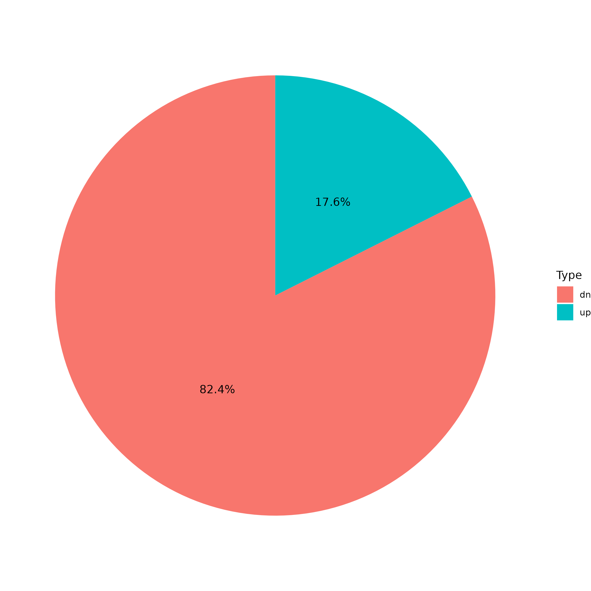
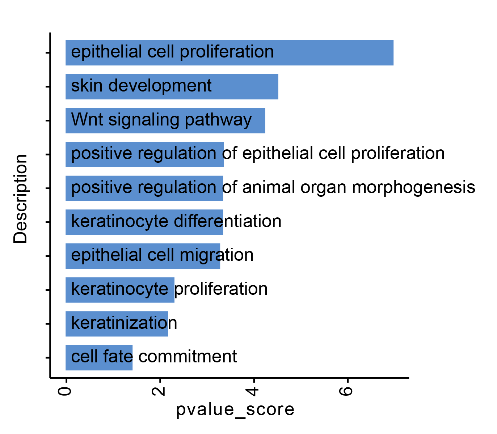
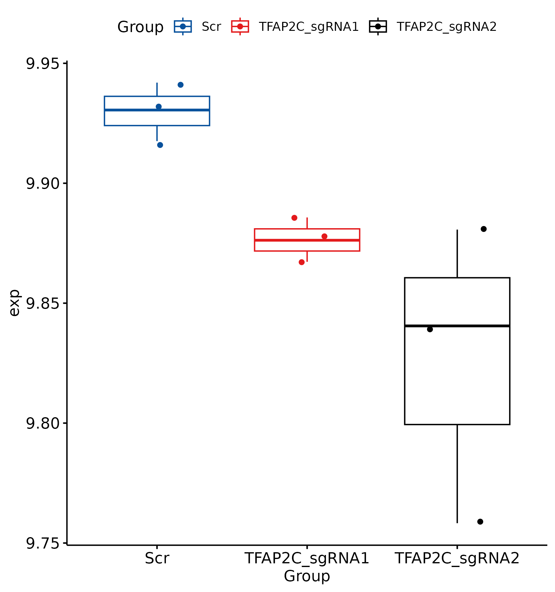
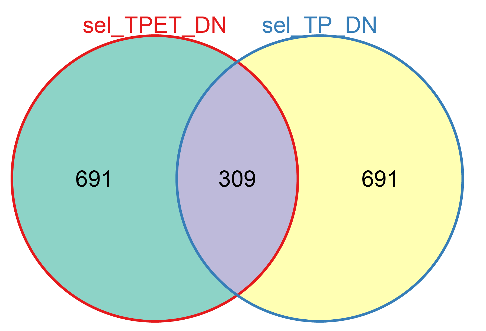
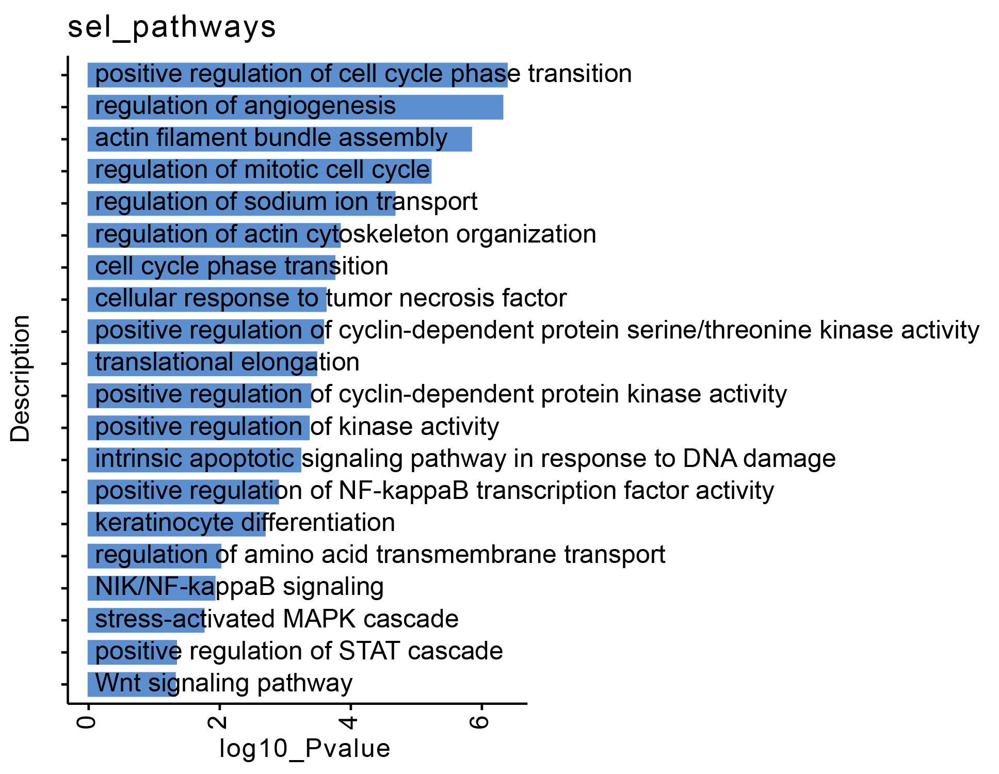

# Data visualization of Figure 6


```R
library(pheatmap)
library(ggplot2)
library(svglite)
library(VennDiagram)
library(clusterProfiler)
library(ChIPseeker)
library(TxDb.Mmusculus.UCSC.mm10.knownGene)


TFAP2C_in_TPE <- read.csv("/mnt/data2/userdata/abao/Published_Project_code/GSCC_code/CUTTag_data/1_TFAP2C_Binding_in_TPE_all_anno_peaks.csv")

TFAP2C_in_TPE_Distal <- subset(TFAP2C_in_TPE,annotation=="Distal Intergenic")
TFAP2C_in_TPE_Promoter <- subset(TFAP2C_in_TPE,annotation=="Promoter (<=1kb)" | annotation=="Promoter (1-2kb)" | annotation=="Promoter (2-3kb)")
TFAP2C_in_TPE_Intron <- subset(TFAP2C_in_TPE, grepl("^Intron", TFAP2C_in_TPE$annotation))
TFAP2C_in_TPE_Exon <- subset(TFAP2C_in_TPE, grepl("^Exon", TFAP2C_in_TPE$annotation))
TFAP2C_in_TPE_3UTR <- subset(TFAP2C_in_TPE, grepl("^3", TFAP2C_in_TPE$annotation))
TFAP2C_in_TPE_5UTR <- subset(TFAP2C_in_TPE, grepl("^5", TFAP2C_in_TPE$annotation))
TFAP2C_in_TPE_DN <- subset(TFAP2C_in_TPE, grepl("^Down", TFAP2C_in_TPE$annotation))

TFAP2C_in_TPE_Distal$group <- "Distal"
TFAP2C_in_TPE_Promoter$group <- "Promoter"
TFAP2C_in_TPE_Intron$group <- "Intron"
TFAP2C_in_TPE_Exon$group <- "Exon"
TFAP2C_in_TPE_3UTR$group <- "3UTR"
TFAP2C_in_TPE_5UTR$group <- "5UTR"
TFAP2C_in_TPE_DN$group <- "Down"

all_tmp <- rbind(TFAP2C_in_TPE_Distal,TFAP2C_in_TPE_Promoter,TFAP2C_in_TPE_Intron,TFAP2C_in_TPE_Exon,TFAP2C_in_TPE_3UTR,TFAP2C_in_TPE_5UTR,TFAP2C_in_TPE_DN)
all_tmp_1 <- data.frame(table(all_tmp$group ))

library(ggplot2)
library(dplyr)
all_tmp_1 <- all_tmp_1 %>%
  mutate(Percentage = Freq / sum(Freq) * 100,
         Label = paste0(Var1, " (", round(Percentage, 1), "%)"))

ff <- ggplot(all_tmp_1, aes(x = "", y = Freq, fill = Var1)) +
  geom_col(width = 1, color = "white") +
  coord_polar(theta = "y") +
  geom_text(aes(label = Label),
            position = position_stack(vjust = 0.5),
            size = 4) +
  theme_void() +
  labs(title = "TFAP2C Binding Distribution") +
  theme(plot.title = element_text(hjust = 0.5))
ggsave(ff,file="Fig6A_TFAP2C_binding_piechart.pdf")
```


```R
library(Seurat)
library(ggplot2)
library(pheatmap)
require(RColorBrewer)

adjusted_heatmap <- function (seurat_obj=seurat_obj, group=group,genes=genes,all_num=all_num,assay_sel=assay_sel,labels_rot=labels_rot,
  color=color,min_and_max_cut=num_cut,new_names=new_names,show_row_names=show_row_names,mark_gene=mark_gene,label_size=label_size,scale=scale){
  message("Processed data begain")
  ATAC <- GetAssayData(seurat_obj,layers ="data",assay=assay_sel)
  ATAC_sel <- ATAC[genes,]
  ATAC_sel <- as.matrix(ATAC_sel)
  if (scale==TRUE) {
    ATAC_sel_zscore <- t(apply(ATAC_sel, 1, function(x) (x-mean(x))/sd(x)))
    } else {
      ATAC_sel_zscore <- ATAC_sel
    }
  sel_cutoff <- min(abs(range(ATAC_sel_zscore)))
  if (is.null(min_and_max_cut)){
    ATAC_sel_zscore[ATAC_sel_zscore > sel_cutoff] <- sel_cutoff
    ATAC_sel_zscore[ATAC_sel_zscore < -sel_cutoff] <- -sel_cutoff
    } else {
      ATAC_sel_zscore[ATAC_sel_zscore > min_and_max_cut] <- min_and_max_cut
      ATAC_sel_zscore[ATAC_sel_zscore < -min_and_max_cut] <- -min_and_max_cut
    }
  meta_info <- seurat_obj@meta.data
  meta_info <- meta_info[order(meta_info[,group],decreasing=F),]
  annotation = data.frame(new_anno=meta_info[group],cell_id=rownames(meta_info))
  colnames(annotation) <- c("new_anno","cell_id")
  if (all_num == TRUE & !is.null(new_names)){
    annotation$new_anno <- paste(new_names,annotation$new_anno,sep="")
    aa <- as.data.frame(table(annotation$new_anno))
    aa <- aa[order(aa$Freq,decreasing=T),]
    aa$Var1 <- as.character(aa$Var1)
    annotation$new_anno <- factor(annotation$new_anno,levels=aa$Var1)
  }
  annotation <- annotation[order(annotation$new_anno),]
  annotation = data.frame(new_anno=annotation$new_anno,row.names=rownames(annotation))
  require(pheatmap)
  message("pheatmap printing start")
  require(ComplexHeatmap)
  require(BuenColors)
  require(scales) 
  col1 <- jdb_palette("Darjeeling2")
  col2 <- jdb_palette("Darjeeling")
  col3 <- jdb_palette("Moonrise3")
  col_sel <- c(col1,col2,col3)
  col_sel <- hue_pal()(length(as.character(unique(annotation$new_anno))))
  col <- col_sel[1:length(as.character(unique(annotation$new_anno)))]
  names(col) <- as.character(unique(annotation$new_anno))
  top_anno <- HeatmapAnnotation(
  cluster = anno_block(gp = gpar(fill = col), 
  labels = as.character(unique(annotation$new_anno)), 
  labels_gp = gpar(cex = label_size , col = "black"),labels_rot=labels_rot))
  if (is.null(mark_gene)){
  ph <- Heatmap(ATAC_sel_zscore[,rownames(annotation)],
    cluster_rows = FALSE,
    cluster_columns = FALSE,
    show_column_names = FALSE,
    show_row_names = show_row_names,
    top_annotation = top_anno,
    col = rev(color),
    column_split = annotation$new_anno,
    column_title_rot = 90, use_raster = TRUE)
    } else {
      both_gene <- intersect(rownames(ATAC_sel_zscore[,rownames(annotation)]),mark_gene)
      gene_pos <- which(rownames(ATAC_sel_zscore[,rownames(annotation)]) %in% both_gene)
      selected_gene <- rownames(ATAC_sel_zscore[,rownames(annotation)])[gene_pos]
      row_anno <-  rowAnnotation(mark_gene = anno_mark(at = gene_pos, labels = selected_gene))
      ph <- Heatmap(ATAC_sel_zscore[,rownames(annotation)],
        cluster_rows = FALSE,
        cluster_columns = FALSE,
        show_column_names = FALSE,
        show_row_names = show_row_names,
        top_annotation = top_anno,
        right_annotation = row_anno,
        col = rev(color),
        column_split = annotation$new_anno,
        column_title_rot = 90, use_raster = TRUE)
    }
    return(ph)
    print(ph)
}


TFAP2C_RNA <- read.csv("/mnt/data2/userdata/abao/Published_Project_code/GSCC_code/RNAseq_data/sgTFAP2C12_VS_sgScr_DEseq_Results.csv")
sig_TFAP2C_RNA <- subset(TFAP2C_RNA,pvalue <=0.05 & abs(log2FoldChange) > 0.2 )

genes_sel <- c("Krt25","Krt16","Meis3","Krtcap2","Krt17","Krt8","Myc","Twist2","Krt5","Krt6a","Trp63","Krt7","Muc1","Muc2")
rownames(sig_TFAP2C_RNA) <- sig_TFAP2C_RNA$X
sig_TFAP2C_RNA <- sig_TFAP2C_RNA[order(-sig_TFAP2C_RNA$log2FoldChange),]
sig_TFAP2C_RNA <- sig_TFAP2C_RNA[,c(2:10)]
sig_TFAP2C_RNA <- na.omit(sig_TFAP2C_RNA)

tmp_data <- log(sig_TFAP2C_RNA+1,2)
chonglai_zscore_1 <- t(apply(tmp_data, 1, function(x) (x-mean(x))/sd(x)))
range(chonglai_zscore_1)
chonglai_zscore_1[chonglai_zscore_1 > 1] <- 1
chonglai_zscore_1[chonglai_zscore_1 < -1] <- -1
SeuratObject <- CreateSeuratObject(counts = chonglai_zscore_1, project = "TM")
gene <- rownames(SeuratObject)
SeuratObject@meta.data$group <- rownames(SeuratObject@meta.data)
pdf("RNAseq_sgTFAP2C_heatmap_label.pdf",width=8,height=9)
adjusted_heatmap(seurat_obj=SeuratObject,group="orig.ident",gene = gene,all_num=FALSE,new_names=NULL,labels_rot=90,
  assay_sel="RNA",color=colorRampPalette(brewer.pal(10, "RdBu"))(101),
  min_and_max_cut=2,show_row_names=FALSE,mark_gene=genes_sel,label_size=0,scale = FALSE)
dev.off()
```


```R
TFAP2C_Binding_in_TPE <- read.csv("/mnt/data2/userdata/abao/Published_Project_code/GSCC_code/CUTTag_data/1_TFAP2C_Binding_in_TPE_all_anno_peaks.csv")
sgTFAP2C12_VS_sgScr_RNAseq <- read.csv("/mnt/data2/userdata/abao/Published_Project_code/GSCC_code/RNAseq_data/sgTFAP2C12_VS_sgScr_DEseq_Results.csv")
sgTFAP2C_DN_RNA <- subset(TFAP2C_RNA,pvalue <=0.05 & log2FoldChange < -0.2 )

length(intersect(unique(sgTFAP2C_DN_RNA$SYMBOL), unique(TFAP2C_Binding_in_TPE$SYMBOL )))
1275
length(unique(sgTFAP2C_DN_RNA$SYMBOL))-length(intersect(unique(sgTFAP2C_DN_RNA$SYMBOL), unique(TFAP2C_Binding_in_TPE$SYMBOL)))

library(ggplot2)
df <- data.frame(
  Type = c("up","dn"),
  num = c(length(unique(sgTFAP2C_DN_RNA$SYMBOL))-length(intersect(unique(sgTFAP2C_DN_RNA$SYMBOL), unique(TFAP2C_Binding_in_TPE$SYMBOL))), 

    length(intersect(unique(sgTFAP2C_DN_RNA$SYMBOL), unique(TFAP2C_Binding_in_TPE$SYMBOL )))
)
)
df$percent <- df$num / sum(df$num) * 100
ff <- ggplot(df, aes(x = "", y = num, fill = Type)) +
  geom_bar(stat = "identity", width = 1) +
  coord_polar(theta = "y") +
  theme_void() + 
  labs(fill = "Type") +
  geom_text(aes(label = sprintf("%.1f%%", percent)), 
            position = position_stack(vjust = 0.5))
ggsave(ff,file="Fig6E_TFAP2C_BINDING_in_RNA.png",width=8,height=8)
```



```R
TFAP2C_RNA <- read.csv("/mnt/data2/userdata/abao/Published_Project_code/GSCC_code/RNAseq_data/sgTFAP2C12_VS_sgScr_DEseq_Results.csv")
TFAP2C_hi <- subset(TFAP2C_RNA, pvalue <=0.05 & log2FoldChange < -0.2)
TFAP2C_Binding_in_TPE <- read.csv("/mnt/data2/userdata/abao/Published_Project_code/GSCC_code/CUTTag_data/1_TFAP2C_Binding_in_TPE_all_anno_peaks.csv")

common_genes <- intersect(unique(TFAP2C_Binding_in_TPE$SYMBOL),unique(TFAP2C_hi$X))
ee <-data.frame(common_genes)
names(ee) <- "Symbol"

ee$ENTREZID <- mapIds(x = org.Mm.eg.db,
   keys = as.character(ee$Symbol),
   keytype ="SYMBOL",
   column ="ENTREZID",
   multiVals="first")

GOupall_summry_all <- enrichGO(gene = as.character(ee$ENTREZID), 
              OrgDb = org.Mm.eg.db,
            ont = "all", 
                   pvalueCutoff = 1, 
                     pAdjustMethod = "BH", 
                     qvalueCutoff = 1,
                     minGSSize = 10, 
                     maxGSSize = 500, 
                     readable = T, 
                     pool = FALSE)
write.csv(GOupall_summry_all,"GO_TFAP2C_binding_RNA_hi_log02.csv")

select_GO <- read.csv("/mnt/data2/userdata/abao/Published_Project_code/GSCC_code/RNAseq_data/TFAP2C_GO_pathway.csv")
select_GO$pvalue_score <- -log10(select_GO$pvalue)
library(ggplot2)
library(ggpubr)

p1 <- ggbarplot(select_GO, 
  x = "Description", 
  y = "pvalue_score",
  color = "#5B8FCF",            # Set bar border colors to white
  fill ="#5B8FCF",
  sort.val = "asc",          # Sort the value in dscending order
  x.text.angle = 90,           # Rotate vertically x axis texts
  rotate = TRUE,
  title="")
ggsave(p1,file="Fig6f_TFAP2C_binding_RNA_hi.svg",width =8, height = 4,dpi=1080)


```




```R
STAD_squamous_sig  <- read.csv("/mnt/data2/userdata/abao/Published_Project_code/GSCC_code/TCGA_data/Squamous_58hi_vs_313low_Wilcox_test_to_mouse_genes.csv")
STAD_squamous_sig <- subset(STAD_squamous_sig,p_values < 0.05 & logFC > 1)
STAD_squamous_sig <- STAD_squamous_sig[order(-STAD_squamous_sig$logFC),]
squamous_sig <- data.frame(STAD_squamous_sig$mmu_gene)
names(squamous_sig) <- "SYMBOL"


Tfap2c_RNAseq <- read.csv("/mnt/data2/userdata/abao/Published_Project_code/GSCC_code/RNAseq_data/sgTFAP2C12_VS_sgScr_DEseq_Results.csv")
squamous_Exp <- merge(Tfap2c_RNAseq,squamous_sig,by="SYMBOL")
squamous_Exp <- squamous_Exp[!duplicated(squamous_Exp$SYMBOL),]

rownames(squamous_Exp) <- squamous_Exp$SYMBOL
squamous_Exp <- squamous_Exp[,c("TFAP2C_sgRNA1_rep1", "TFAP2C_sgRNA1_rep2", "TFAP2C_sgRNA1_rep3", "TFAP2C_sgRNA2_rep1", "TFAP2C_sgRNA2_rep2", "TFAP2C_sgRNA2_rep3", "Scr_1","Scr_2", "Scr_3" )]
squamous_Exp_1 <- data.frame(apply(squamous_Exp,2,mean)) 
squamous_Exp <- data.frame(squamous_Exp_1)
names(squamous_Exp) <- "squamous_exp"

names(squamous_Exp) <- "exp"
tmp_log2 <- log(squamous_Exp+1,2)
tmp_log2$Group <- c("TFAP2C_sgRNA1", "TFAP2C_sgRNA1", "TFAP2C_sgRNA1", "TFAP2C_sgRNA2", "TFAP2C_sgRNA2", "TFAP2C_sgRNA2", "Scr","Scr", "Scr")
tmp_log2$Group <- factor(tmp_log2$Group,levels=c("Scr","TFAP2C_sgRNA1", "TFAP2C_sgRNA2"))
library(ggplot2)
library(ggpubr)
my_comparisons <- list(c("Scr","TFAP2C_sgRNA1"),c("Scr","TFAP2C_sgRNA2"))

ff <- ggboxplot(tmp_log2, x = "Group", y = "exp",add = "jitter",
               color = "Group",palette = c("#08519c","#e31a1c","#000000")) 
ggsave(ff,file="Fig6G_GSCC_TFAP2C_Squamous_boxplot.png",width=6,height=6.4)
```





```R
library(ggplot2)
library(ggpubr)

TPET_VS_TPE <- read.csv("/mnt/data2/userdata/abao/Published_Project_code/GSCC_code/RNAseq_data/sgTFAP2C12_VS_sgScr_DEseq_Results.csv")
TPE_VS_TP <- read.csv("/mnt/data2/userdata/abao/Published_Project_code/GSCC_code/RNAseq_data/Tumor_DEseq2normalized_TPE_VS_TP_allsummry.csv")

TPET_VS_TPE$cc_score <- TPET_VS_TPE$baseMean^2*TPET_VS_TPE$log2FoldChange
TPE_VS_TP$cc_score <- TPE_VS_TP$baseMean^2*TPE_VS_TP$log2FoldChange

TPET_VS_TPE <- TPET_VS_TPE[order(TPET_VS_TPE$cc_score),]
TPE_VS_TP <- TPE_VS_TP[order(-TPE_VS_TP$cc_score),]

sel_TPET_DN <- TPET_VS_TPE[1:1000,]
sel_TP_DN <- TPE_VS_TP[1:1000,]

library(Vennerable)
data1 <- Venn(list("sel_TPET_DN"=unique(na.omit(sel_TPET_DN$X)),"sel_TP_DN"=unique(na.omit(sel_TP_DN$X))))
pdf("Fig6h_TPET_DN_TP_common.pdf")
plot(data1,doWeight=T)
dev.off()

TPE_up_ENTREZID <- intersect(unique(na.omit(sel_TPET_DN$ENTREZID)), unique(na.omit(sel_TP_DN$ENTREZID)))
dd <- as.vector(TPE_up_ENTREZID)
GOupres_1_all <- enrichGO(gene = dd, 
             OrgDb = org.Mm.eg.db,
        ont = "all", 
                 pvalueCutoff = 1, 
                     pAdjustMethod = "BH", 
                     qvalueCutoff = 1,
                     minGSSize = 5, 
                     maxGSSize = 500, 
                     readable = T, 
                     pool = FALSE)
write.csv(GOupres_1_all,"ccscore_TPE_common_GO_top1000.csv")
aa1 <- enrich_pvalue(24421,691,691,309)

GOupres_1_all <- read.csv("/mnt/data2/userdata/abao/Published_Project_code/GSCC_code/RNAseq_data/ccscore_TPE_common_GO_top1000.csv")
GOupres_1_all_1 <- data.frame(GOupres_1_all@result)
sel_pathways <- subset(GOupres_1_all_1, Description== "positive regulation of cell cycle phase transition" | 
  Description== "regulation of angiogenesis" | Description== "actin filament bundle assembly" | 
  Description== "regulation of mitotic cell cycle" | Description== "regulation of sodium ion transport" | 
  Description== "regulation of actin cytoskeleton organization" | Description== "cell cycle phase transition" | 
  Description== "cellular response to tumor necrosis factor" | 
  Description== "positive regulation of cyclin-dependent protein serine/threonine kinase activity" | 
  Description== "translational elongation" | Description== "positive regulation of cyclin-dependent protein kinase activity" | 
  Description== "positive regulation of kinase activity" | Description== "intrinsic apoptotic signaling pathway in response to DNA damage" | 
  Description== "positive regulation of NF-kappaB transcription factor activity" | Description== "keratinocyte differentiation" | 
  Description== "regulation of amino acid transmembrane transport" | Description== "NIK/NF-kappaB signaling" | 
  Description== "stress-activated MAPK cascade" | Description== "positive regulation of STAT cascade" | Description== "Wnt signaling pathway" )

sel_pathways$log10_Pvalue <- -log(sel_pathways$pvalue, 10)
sel_pathways_10 <- head(sel_pathways,20)
p1 <- ggbarplot(sel_pathways_10, 
  x = "Description", 
  y = "log10_Pvalue",
  color = "#5B8FCF",            # Set bar border colors to white
  fill ="#5B8FCF",
  sort.val = "asc",          # Sort the value in dscending order
  x.text.angle = 90,           # Rotate vertically x axis texts
  rotate = TRUE,
  title="sel_pathways")
ggsave(p1,file="Fig6i_pathwaysBP_TPE_up.svg",width =10, height =5,dpi=1080)
```





```shell

java -cp /mnt/data/user_data/xiangyu/programme/gsea/gsea-3.0.jar -Xmx10240m xtools.gsea.Gsea \
-res /mnt/data/user_data/abao/Bulk_project/1_bulk_RNA/ZhangMengsha_EZH2/TFAP2C_sgRNA1.gct \
-cls /mnt/data/user_data/abao/Bulk_project/1_bulk_RNA/ZhangMengsha_EZH2/TFAP2C_sgRNA1.cls#sgRNA1_versus_Scr \
-gmx /mnt/data/user_data/xiangyu/programme/gsea/msigdb_v6.1_GMTs/h.all.v6.1.symbols.gmt \
-chip /mnt/data/user_data/xiangyu/programme/gsea/chip/ENSEMBL_mouse_gene.chip \
-collapse true -mode Max_probe -norm meandiv -nperm 1000 -permute gene_set \
-rnd_type no_balance -scoring_scheme weighted -rpt_label my_analysis \
-metric Signal2Noise -sort real -order descending -include_only_symbols true \
-make_sets true -median false -num 100 -plot_top_x 200 -rnd_seed timestamp \
-save_rnd_lists false -set_max 1000 -set_min 5 -zip_report false \
-out /mnt/data/user_data/abao/Bulk_project/1_bulk_RNA/ZhangMengsha_EZH2/TFAP2C_sgRNA1_h -gui false

java -cp /mnt/data/user_data/xiangyu/programme/gsea/gsea-3.0.jar -Xmx10240m xtools.gsea.Gsea \
-res /mnt/data/user_data/abao/Bulk_project/1_bulk_RNA/ZhangMengsha_EZH2/TFAP2C_sgRNA1.gct \
-cls /mnt/data/user_data/abao/Bulk_project/1_bulk_RNA/ZhangMengsha_EZH2/TFAP2C_sgRNA1.cls#sgRNA1_versus_Scr \
-gmx /mnt/data/user_data/xiangyu/programme/gsea/msigdb_v6.1_GMTs/c2.all.v6.1.symbols.gmt \
-chip /mnt/data/user_data/xiangyu/programme/gsea/chip/ENSEMBL_mouse_gene.chip \
-collapse true -mode Max_probe -norm meandiv -nperm 1000 -permute gene_set \
-rnd_type no_balance -scoring_scheme weighted -rpt_label my_analysis \
-metric Signal2Noise -sort real -order descending -include_only_symbols true \
-make_sets true -median false -num 100 -plot_top_x 200 -rnd_seed timestamp \
-save_rnd_lists false -set_max 1000 -set_min 5 -zip_report false \
-out /mnt/data/user_data/abao/Bulk_project/1_bulk_RNA/ZhangMengsha_EZH2/TFAP2C_sgRNA1_c2 -gui false

java -cp /mnt/data/user_data/xiangyu/programme/gsea/gsea-3.0.jar -Xmx10240m xtools.gsea.Gsea \
-res /mnt/data/user_data/abao/Bulk_project/1_bulk_RNA/ZhangMengsha_EZH2/TFAP2C_sgRNA1.gct \
-cls /mnt/data/user_data/abao/Bulk_project/1_bulk_RNA/ZhangMengsha_EZH2/TFAP2C_sgRNA1.cls#sgRNA1_versus_Scr \
-gmx /mnt/data/user_data/xiangyu/programme/gsea/msigdb_v6.1_GMTs/c5.all.v6.1.symbols.gmt \
-chip /mnt/data/user_data/xiangyu/programme/gsea/chip/ENSEMBL_mouse_gene.chip \
-collapse true -mode Max_probe -norm meandiv -nperm 1000 -permute gene_set \
-rnd_type no_balance -scoring_scheme weighted -rpt_label my_analysis \
-metric Signal2Noise -sort real -order descending -include_only_symbols true \
-make_sets true -median false -num 100 -plot_top_x 200 -rnd_seed timestamp \
-save_rnd_lists false -set_max 1000 -set_min 5 -zip_report false \
-out /mnt/data/user_data/abao/Bulk_project/1_bulk_RNA/ZhangMengsha_EZH2/TFAP2C_sgRNA1_c5 -gui false


java -cp /mnt/data/user_data/xiangyu/programme/gsea/gsea-3.0.jar -Xmx10240m xtools.gsea.Gsea \
-res /mnt/data/user_data/abao/Bulk_project/1_bulk_RNA/ZhangMengsha_EZH2/TFAP2C_sgRNA2.gct \
-cls /mnt/data/user_data/abao/Bulk_project/1_bulk_RNA/ZhangMengsha_EZH2/TFAP2C_sgRNA2.cls#sgRNA2_versus_Scr \
-gmx /mnt/data/user_data/xiangyu/programme/gsea/msigdb_v6.1_GMTs/h.all.v6.1.symbols.gmt \
-chip /mnt/data/user_data/xiangyu/programme/gsea/chip/ENSEMBL_mouse_gene.chip \
-collapse true -mode Max_probe -norm meandiv -nperm 1000 -permute gene_set \
-rnd_type no_balance -scoring_scheme weighted -rpt_label my_analysis \
-metric Signal2Noise -sort real -order descending -include_only_symbols true \
-make_sets true -median false -num 100 -plot_top_x 200 -rnd_seed timestamp \
-save_rnd_lists false -set_max 1000 -set_min 5 -zip_report false \
-out /mnt/data/user_data/abao/Bulk_project/1_bulk_RNA/ZhangMengsha_EZH2/TFAP2C_sgRNA2_h -gui false

java -cp /mnt/data/user_data/xiangyu/programme/gsea/gsea-3.0.jar -Xmx10240m xtools.gsea.Gsea \
-res /mnt/data/user_data/abao/Bulk_project/1_bulk_RNA/ZhangMengsha_EZH2/TFAP2C_sgRNA2.gct \
-cls /mnt/data/user_data/abao/Bulk_project/1_bulk_RNA/ZhangMengsha_EZH2/TFAP2C_sgRNA2.cls#sgRNA2_versus_Scr \
-gmx /mnt/data/user_data/xiangyu/programme/gsea/msigdb_v6.1_GMTs/c2.all.v6.1.symbols.gmt \
-chip /mnt/data/user_data/xiangyu/programme/gsea/chip/ENSEMBL_mouse_gene.chip \
-collapse true -mode Max_probe -norm meandiv -nperm 1000 -permute gene_set \
-rnd_type no_balance -scoring_scheme weighted -rpt_label my_analysis \
-metric Signal2Noise -sort real -order descending -include_only_symbols true \
-make_sets true -median false -num 100 -plot_top_x 200 -rnd_seed timestamp \
-save_rnd_lists false -set_max 1000 -set_min 5 -zip_report false \
-out /mnt/data/user_data/abao/Bulk_project/1_bulk_RNA/ZhangMengsha_EZH2/TFAP2C_sgRNA2_c2 -gui false

java -cp /mnt/data/user_data/xiangyu/programme/gsea/gsea-3.0.jar -Xmx10240m xtools.gsea.Gsea \
-res /mnt/data/user_data/abao/Bulk_project/1_bulk_RNA/ZhangMengsha_EZH2/TFAP2C_sgRNA2.gct \
-cls /mnt/data/user_data/abao/Bulk_project/1_bulk_RNA/ZhangMengsha_EZH2/TFAP2C_sgRNA2.cls#sgRNA2_versus_Scr \
-gmx /mnt/data/user_data/xiangyu/programme/gsea/msigdb_v6.1_GMTs/c5.all.v6.1.symbols.gmt \
-chip /mnt/data/user_data/xiangyu/programme/gsea/chip/ENSEMBL_mouse_gene.chip \
-collapse true -mode Max_probe -norm meandiv -nperm 1000 -permute gene_set \
-rnd_type no_balance -scoring_scheme weighted -rpt_label my_analysis \
-metric Signal2Noise -sort real -order descending -include_only_symbols true \
-make_sets true -median false -num 100 -plot_top_x 200 -rnd_seed timestamp \
-save_rnd_lists false -set_max 1000 -set_min 5 -zip_report false \
-out /mnt/data/user_data/abao/Bulk_project/1_bulk_RNA/ZhangMengsha_EZH2/TFAP2C_sgRNA2_c5 -gui false

```

